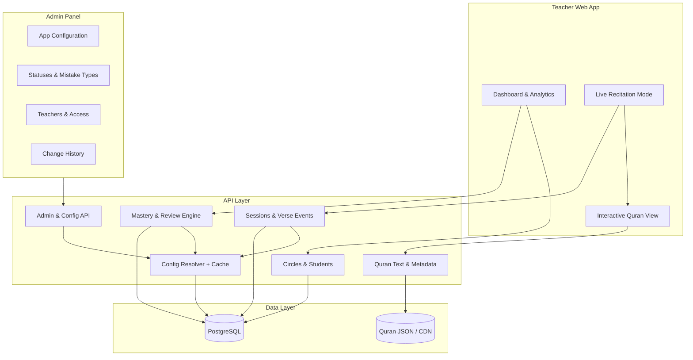
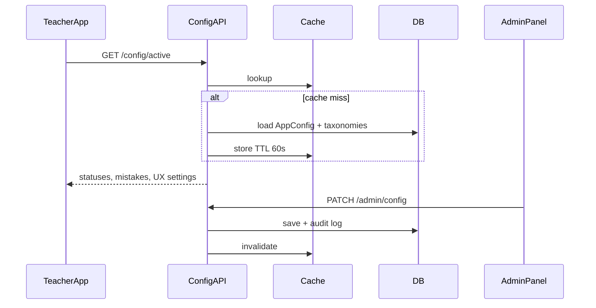
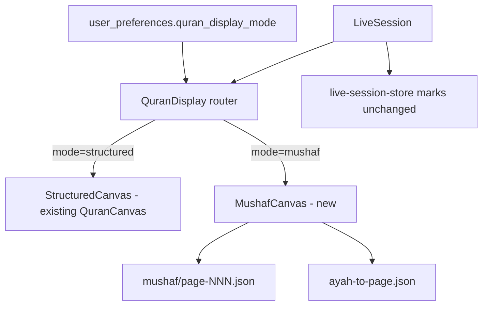

# Quran Circle Management Platform — Implementation Plan

This plan translates `APP_DESIGN.md` into a buildable product. The repo is greenfield (design doc only), so the plan includes stack recommendations, architecture, data model, a **config-driven admin panel**, phased delivery, and open decisions for your approval.

---

## 1. Guiding Principles (Non-Negotiable)

Every technical decision should serve these design constraints:

| Principle | Implementation implication |
|-----------|---------------------------|
| **Assume correct by default** | No per-verse tap required; only record exceptions |
| **Speed during live sessions** | Large touch targets, instant feedback, no modals for common actions |
| **Tap to advance** | 1st tap = 2nd attempt; 2nd tap = 3rd attempt; 3rd tap = mistakes panel |
| **Complete history** | Every session, verse event, and note is immutable audit data |
| **Quality over completion** | Mastery scoring weights reminders/prompts, not just verse count |
| **Configurable without deploys** | Scoring rules, taxonomies, and UX thresholds live in the admin panel — not hardcoded |

---

## 2. Recommended Tech Stack

Proposed defaults (adjustable before build):

| Layer | Choice | Rationale |
|-------|--------|-----------|
| **Frontend** | Next.js 15 (App Router) + TypeScript | SSR for dashboards; fast client UI for live mode |
| **UI** | Tailwind CSS + shadcn/ui | Rapid, accessible components; easy custom live-session UI |
| **State (live session)** | Zustand or React context | Local, optimistic updates; sync on save |
| **Backend** | Next.js API routes or separate Hono/Fastify service | Start colocated; split later if needed |
| **Database** | PostgreSQL (Neon/Supabase) | Relational fit for students, sessions, verse events |
| **ORM** | Drizzle or Prisma | Type-safe schema, migrations |
| **Auth** | Clerk or NextAuth (email/password) | Role-based: `teacher` + `admin` (super-admin) from day one |
| **Quran text** | Bundled JSON (e.g. quran-json / Tanzil) | Offline-capable verse display; surah/ayah index |
| **Deployment** | Vercel + managed Postgres | Simple CI/CD for solo/small team |

**Alternative:** Full-stack on Cloudflare (Workers + D1) if you want edge/low cost — viable but more setup for analytics-heavy queries.

---

## 3. High-Level Architecture



**Domain modules:**

1. **Identity & tenancy** — teacher accounts, admin accounts, circles (multi-tenant by teacher)
2. **Roster** — students, groups, memorization plans
3. **Recitation** — sessions, verse statuses, mistakes, notes
4. **Analytics** — mastery, trends, review recommendations, mastery map
5. **Quran content** — surahs, ayahs, Arabic text (read-only)
6. **Admin & configuration** — platform settings, taxonomies, feature flags, audit trail

---

## 4. Data Model (Core Entities)

### 4.1 Identity & organization

```
User (unified account)
  - id, email, name, role: teacher | admin
  - status: active | suspended, created_at, last_login_at

Teacher (extends User — same row or 1:1 profile)
  - user_id, display preferences (optional)

Circle
  - id, teacher_id, name, description, created_at

Student
  - id, circle_id, full_name, contact_info, created_at, archived_at?

MemorizationPlan (per student)
  - id, student_id
  - current_surah, current_start_ayah, current_end_ayah
  - next_surah, next_start_ayah, next_end_ayah
  - updated_at
```

### 4.2 Review targets (planned passages)

```
ReviewTarget
  - id, student_id, surah, start_ayah, end_ayah
  - priority (manual or auto), source (manual | algorithm)
  - last_reviewed_at, created_at
```

### 4.3 Recitation sessions

```
RecitationSession
  - id, student_id, circle_id, teacher_id
  - started_at, ended_at, duration_seconds
  - summary_json (denormalized counts for fast reads)

SessionPassage (1..n per session — new memorization + review in one sitting)
  - id, session_id, sort_order
  - surah, start_ayah, end_ayah

VerseRecord (one per ayah touched in session; default = correct)
  - id, session_id, surah, ayah
  - status: correct | reminder | second_attempt | prompting | incomplete
  - updated_at

Mistake (0..n per VerseRecord)
  - id, verse_record_id
  - category: memorization | tajweed | behavior
  - subcategory_slug (references admin-managed MistakeSubcategory)
  - note (optional)

Note
  - id, scope: verse | session | student
  - ref_id (verse_record_id | session_id | student_id)
  - body, created_at, teacher_id
```

### 4.4 Aggregates (computed / materialized)

```
StudentMasterySnapshot (optional cache, refreshed after session)
  - student_id, surah, ayah
  - state: memorized | needs_review | frequently_weak | not_recited
  - mastery_score, mistake_count, last_recited_at

StudentAnalytics (rollup table or view)
  - total_verses_recited, mastery_pct, trend, top mistake categories, etc.
```

**Indexing:** `(student_id, surah, ayah)`, `(session_id)`, `(circle_id, student_id)`.

### 4.5 Admin & platform configuration

All tunable app behavior is stored in the database and resolved at runtime via a **Config Service** (in-memory cache with short TTL + invalidation on admin save).

```
AppConfig (key-value, typed JSON payload)
  - key (unique), value_json, value_type: number | string | boolean | json
  - category: mastery | review | live_session | display | feature_flags | system
  - label, description (shown in admin UI)
  - updated_at, updated_by (admin user_id)

VerseStatusDefinition (admin-managed taxonomy)
  - id, slug (e.g. reminder_required), label_en, label_ar?
  - score_points (used in mastery calc), color, icon, sort_order
  - is_active, is_default_implicit (exactly one = correct/default)

MistakeCategory (admin-managed)
  - id, slug (memorization | tajweed | behavior), label_en, label_ar?
  - sort_order, is_active

MistakeSubcategory
  - id, category_id, slug, label_en, label_ar?
  - sort_order, is_active

FeatureFlag
  - key, enabled, description, scope: global | teacher

ConfigAuditLog (append-only)
  - id, admin_user_id, entity_type, entity_id, field, old_value, new_value
  - changed_at, change_reason (optional)
```

**Design rules:**

- Teacher app **never** hardcodes scoring weights or mistake lists — it reads active definitions from the API/config cache.
- Historical sessions store **slug references** at write time (e.g. `status: reminder_required`, `mistake: madd`) so admin label changes do not rewrite past data.
- Admin changes to **scoring weights** apply to **future** calculations; optional "recalculate all" job for backfills (admin-triggered, Phase 4+).
- Seed migrations populate sensible defaults matching §5–§6; admin panel edits them from day one.

---

## 5. Verse Status & Mistake Taxonomy

### 5.1 Verse statuses (from design)

| Status | UX | Default? |
|--------|-----|----------|
| Correct | No action | **Yes (implicit)** |
| Reminder Required | Single quick action |
| Second Attempt | 1st tap on ayah (immediate) |
| Third Attempt | 2nd tap on ayah (immediate) |
| Prompting Required | Admin-only / legacy status |
| Incomplete | Admin-only / legacy status |

**Interaction model (attempt cycle — no picker):**

- **1st tap** on ayah → immediately mark `second_attempt`
- **2nd tap** on same ayah → immediately mark `third_attempt`
- **3rd tap** on same ayah → open mistakes panel (tags + optional note)
- Further taps on ayah with mistakes → reopen mistakes panel
- **Undo** — reverts last mark or panel save (critical for live flow)

No status picker overlay. No long press during live session.

### 5.2 Mistake subcategories (admin-managed, seeded defaults)

**Memorization:** `forgotten_word`, `forgotten_verse`, `similar_verse_confusion`, `word_order`, `missing_phrase`

**Tajweed:** `madd`, `ghunnah`, `noon_meem_rules`, `waqf_ibtida`, `pronunciation`, `articulation`

**Behavior:** `hesitation`, `slow_recall`, `lack_of_confidence`, `loss_of_concentration`

Multiple tags per verse allowed. Admins can add, rename (labels), reorder, or deactivate types without a code deploy. Deactivated types remain valid on historical records but are hidden in live session UI.

---

## 6. Mastery Calculation (Specification)

Define a **verse-level score** after each session, then roll up.

**Per-verse session score (0–100):**

| Status / factor | Points |
|-----------------|--------|
| Correct (default) | 100 |
| Reminder Required | 85 |
| Second Attempt | 70 |
| Third Attempt | 60 |
| Prompting Required | 50 |
| Incomplete | 0 |
| Each mistake tag | −5 (floor at status base) |

**Student mastery %** = weighted average of last *N* recitations per ayah (e.g. last 3 sessions), with decay for older data.

**Mastery map states:**

| State | Rule (tunable) |
|-------|----------------|
| Memorized | avg score ≥ 90, recited in last 90 days |
| Needs Review | avg 70–89 OR mistake in last 2 sessions |
| Frequently Weak | avg < 70 OR ≥3 mistakes same ayah in 30 days |
| Not Yet Recited | no `VerseRecord` |

All numeric values above are **default seeds** — admins override them via the Admin Panel (§8). The mastery engine reads live config; teachers see a read-only "how scoring works" page fed from the same source.

---

## 7. API Surface (REST-ish)

| Area | Endpoints |
|------|-----------|
| Circles | `GET/POST /circles`, `GET/PATCH/DELETE /circles/:id` |
| Students | CRUD under circle; `GET /students/:id/dashboard` |
| Plans | `GET/PATCH /students/:id/memorization-plan`, review targets CRUD |
| Sessions | `POST /sessions` (start), `PATCH /sessions/:id/verse` (batch verse updates), `POST /sessions/:id/end` |
| History | `GET /students/:id/sessions`, `GET /sessions/:id` |
| Analytics | `GET /students/:id/analytics`, `GET /students/:id/mastery-map` |
| Review | `GET /students/:id/review-recommendations` |
| Quran | `GET /quran/surahs`, `GET /quran/:surah` (ayahs) |
| Notes | `POST /notes` |
| **Config (public read)** | `GET /config/active` — verse statuses, mistake types, live-session UX settings (cached) |
| **Admin — config** | `GET/PATCH /admin/config`, `GET /admin/config/audit` |
| **Admin — taxonomies** | CRUD `/admin/verse-statuses`, `/admin/mistake-categories`, `/admin/mistake-subcategories` |
| **Admin — users** | `GET/POST/PATCH /admin/users` (invite, suspend, role change) |
| **Admin — teachers** | `GET /admin/teachers`, `GET /admin/teachers/:id/circles` (read-only oversight) |
| **Admin — feature flags** | `GET/PATCH /admin/feature-flags` |
| **Admin — system** | `POST /admin/jobs/recalculate-mastery` (optional backfill) |

**Live session optimization:** `PATCH /sessions/:id/verses` accepts **batch** updates to reduce network calls.

**Auth:** All `/admin/*` routes require `role: admin`. Teachers receive only `GET /config/active`.

---

## 8. Admin Panel

The admin panel is a **first-class product surface** — not an afterthought. It lets platform owners tune behavior, taxonomies, and access without redeploying code.

### 8.1 Purpose & access model

| Role | Access |
|------|--------|
| **Admin** | Full `/admin/*` — config, taxonomies, users, audit log, feature flags |
| **Teacher** | Teacher app only; reads active config via API; no admin routes |
| **Suspended user** | Blocked from both apps |

- Separate layout shell under `/admin` (distinct nav, no live-session UI).
- First admin bootstrapped via env/seeder; subsequent admins created in-panel.
- Every config save writes to `ConfigAuditLog` (who, what, when, old → new).

### 8.2 Admin-controlled variable groups

| Group | Example keys | Affects |
|-------|----------------|---------|
| **Mastery scoring** | `mastery.status_points.*`, `mastery.mistake_penalty`, `mastery.rolling_window_sessions` | Session scores, dashboards, mastery map |
| **Mastery map thresholds** | `mastery.map.memorized_min_score`, `mastery.map.stale_days`, `mastery.map.weak_mistake_count` | Heatmap states (§6) |
| **Review engine** | `review.urgency_mistake_weight`, `review.urgency_mastery_weight`, `review.stale_day_divisor`, `review.max_recommendations` | Review suggestions (§12) |
| **Live session UX** | `live.tap_mode` (attempt_cycle), `live.undo_depth`, `live.auto_start_timer` | Live Recitation Mode (§9.2) |
| **Quran display** | `display.quran_font`, `display.quran_font_size`, `display.ayah_marker_style` | Interactive Quran view |
| **Verse statuses** | Full CRUD on `VerseStatusDefinition` | Tap actions, colors, scoring |
| **Mistake types** | Full CRUD on categories + subcategories | Long-press panel chips |
| **Feature flags** | `features.mastery_map`, `features.review_auto`, `features.offline_queue` | Gradual rollout / kill switches |
| **System** | `system.session_immutability_hours`, `system.max_students_per_circle` | Data integrity & limits |

### 8.3 Admin routes & screens

```
/admin                          → Overview (stats, recent config changes, system health)
/admin/config                   → Grouped settings forms with validation + reset-to-default
/admin/verse-statuses           → List/edit verse status definitions (points, labels, colors)
/admin/mistake-types            → Category + subcategory tree editor
/admin/users                    → Teacher & admin accounts (invite, suspend, role)
/admin/teachers/[id]            → Read-only: circles, student count, last activity
/admin/feature-flags            → Toggle features on/off
/admin/audit-log                → Searchable history of all admin changes
/admin/scoring-preview          → Simulate verse score for a status + mistakes combo
```

### 8.4 Admin UI requirements

- Form validation with min/max bounds on numeric config (prevent invalid mastery math).
- **Preview / dry-run** before saving scoring changes (show impact on a sample session).
- **Reset to default** per config group (re-seed from migration defaults).
- Confirm dialogs on destructive actions (deactivate status in use, suspend teacher).
- No direct edit of student recitation data — admin configures the **system**, teachers own **operational** data.
- Config changes propagate to teacher app within cache TTL (target: < 60s; admin save triggers cache bust).

### 8.5 Config resolution flow



---

## 9. UI Structure & Key Screens (Teacher App)

### 9.1 App shell

- **Sidebar:** Circles → Students → (global) Settings
- **Routes:**
  - `/circles` — list/create circles
  - `/circles/[id]` — roster + stats
  - `/students/[id]` — student dashboard
  - `/students/[id]/plan` — memorization plan
  - `/students/[id]/history` — session list
  - `/students/[id]/mastery-map` — Quran heatmap
  - `/session/new` — session setup
  - `/session/[id]/live` — **primary live screen**
  - `/session/[id]/summary` — post-session

### 9.2 Live Recitation Mode (highest priority UI)

**Layout:**

```
┌─────────────────────────────────────────────┐
│ Student · Surah · Range    ⏱ 12:34  ✕ 3   │  ← sticky header
├─────────────────────────────────────────────┤
│                                             │
│         Interactive Quran (scroll)          │  ← Arabic, RTL, ayah markers
│    Tap: 2nd attempt → 3rd attempt → mistakes │
│                                             │
├─────────────────────────────────────────────┤
│ [Undo]  [End Session]                       │  ← minimal footer
└─────────────────────────────────────────────┘
```

**Requirements:**

- RTL Arabic typography (e.g. Amiri, Scheherazade, or dedicated Quran font)
- Visible ayah boundaries; subtle status tint on marked verses only
- Session timer (auto-start on enter live mode)
- Mistake counter in header (live increment)
- **No** required navigation away during session
- Touch-first; keyboard shortcuts optional for desktop

### 9.3 Mistakes detail panel (opens on 3rd tap)

- Bottom sheet (mobile) / side panel (desktop)
- Opens on 3rd tap of ayah (after 2nd and 3rd attempt marks)
- Mistake category chips (multi-select)
- Optional note field
- Save closes panel; verse keeps attempt status + mistake tags

### 9.4 Session summary

- Stats cards: verses, mistakes, reminders, prompts, mastery score
- Top mistake categories (bar chart)
- CTA: "View student dashboard" / "Start another session"

### 9.5 Student dashboard

- Latest sessions, current/next/review targets, mastery %, common mistakes, totals

### 9.6 Quran Mastery Map

- Grid or surah-list heatmap (30 juz / 114 surahs — start with surah-level, drill to ayah)
- Color legend: memorized / needs review / weak / not recited
- Click surah → ayah detail

---

## 10. Phased Implementation

### Phase 0 — Foundation (Week 1)

**Goal:** Runnable app skeleton + data layer + config foundation.

- [ ] Repo scaffold: Next.js, TS, Tailwind, ESLint, Prettier
- [ ] PostgreSQL + ORM schema (entities in §4, including §4.5 admin tables)
- [ ] Auth with roles (`teacher` | `admin`); bootstrap first admin via seeder
- [ ] Seed Quran JSON (114 surahs, ayah text + numbers)
- [ ] Seed default `AppConfig`, verse statuses, mistake categories (§5–§6 defaults)
- [ ] Config Service + `GET /config/active` endpoint with cache
- [ ] Basic layout shells: teacher routes + `/admin` empty shell (role-gated)
- [ ] Admin audit log table + write helper (used by all admin saves)

**Exit criteria:** Teacher and admin can sign in; Quran text loads; active config served from DB.

---

### Phase 1 — Circles, Students & Admin MVP (Week 2)

**Goal:** Organizational CRUD + core admin panel.

**Teacher app:**

- [ ] Circle CRUD
- [ ] Student CRUD + roster per circle
- [ ] Student profile page (static sections, no analytics yet)
- [ ] Memorization plan editor (current / next / review targets)

**Admin panel:**

- [ ] Admin dashboard (overview + recent audit entries)
- [ ] App config editor — mastery, review, live-session, display groups (§8.2)
- [ ] Verse status CRUD (labels, points, colors, active/inactive)
- [ ] Mistake category + subcategory CRUD
- [ ] User management (list teachers, invite, suspend, assign role)
- [ ] Audit log viewer (read-only, filterable)

**Exit criteria:** Admin can change scoring weights and mistake types; teacher app reflects changes after cache bust. Full roster management works.

---

### Phase 2 — Live Recitation MVP (Weeks 3–4) ⭐ Core product

**Goal:** End-to-end session flow usable in a real circle.

- [ ] Session setup (student, multiple surah ranges — add/remove passages)
- [ ] Live Recitation Mode UI (reads `live.*` config: attempt cycle, undo depth)
- [ ] Interactive Quran view (range-limited scroll; font from `display.*` config)
- [ ] 3-tap attempt cycle (1st = 2nd attempt, 2nd = 3rd attempt, 3rd = mistakes panel)
- [ ] Mistakes detail panel on 3rd tap + dynamic mistake tags from admin taxonomy
- [ ] Session timer + mistake counter
- [ ] Undo last action
- [ ] End session → persist + summary screen
- [ ] Session history list on student profile

**Exit criteria:** Teacher completes a full session with minimal taps; data persists.

---

### Phase 3 — Mastery & Analytics (Week 5)

**Goal:** Insights from recorded data.

- [ ] Mastery calculation engine (§6) — all weights from `AppConfig`, not constants
- [ ] Admin scoring preview tool (§8.3 `/admin/scoring-preview`)
- [ ] Session summary mastery score + category breakdown
- [ ] Student dashboard metrics (trends, totals, common mistakes)
- [ ] Per-surah strongest/weakest lists

**Exit criteria:** Dashboard reflects real session data with consistent scores.

---

### Phase 4 — Mastery Map & Review Engine (Week 6)

**Goal:** Visual progress + automated review suggestions.

- [ ] Ayah/surah mastery map visualization (thresholds from admin config)
- [ ] Review recommendation API (weights from `review.*` config)
- [ ] Admin feature flags UI; optional mastery recalculate job
- [ ] Surface recommendations on student dashboard + plan page

**Exit criteria:** Teacher sees weak areas at a glance and suggested review list.

---

### Phase 5 — Polish & Production (Week 7)

**Goal:** Reliability and teacher trust.

- [ ] Admin teacher oversight view (read-only circles / activity per teacher)
- [ ] Session-level and student-level notes
- [ ] Error handling, offline-tolerant draft (localStorage queue for verse events)
- [ ] Performance: virtualized Quran list for long ranges
- [ ] Accessibility (ARIA, focus trap in panels)
- [ ] E2E tests for live session happy path
- [ ] Deploy staging + production

**Exit criteria:** Stable enough for daily use by one teacher.

---

### Phase 6+ — Roadmap (post-MVP, per design doc)

Deferred until MVP validated: attendance, parent portal, supervisor dashboard, badges, audio, mobile apps, multi-teacher.

---

### Phase 7 — Intelligence & Insights (post-M5)

**Goal:** Turn historical data into teaching intelligence — weak ayat, automated review, patterns, reports, timeline, and (future) AI summaries.  
**Exit:** Teacher can identify persistent weaknesses, generate review sessions, share parent reports, and view progress timeline.

#### 7.1 Repeated Weak Ayat Engine

| Item | Specification |
|------|---------------|
| **Purpose** | Rank ayat by recurring mistakes across all sessions |
| **Data** | Aggregate `VerseRecord` + `Mistake` by `(student_id, surah, ayah)` |
| **Algorithm** | `mistake_count`, `session_count_with_mistakes`, `last_mistake_at`, `persistent = sessions ≥ 2` |
| **API** | `GET /api/students/:id/weak-ayat?limit=&minSessions=` |
| **UI** | `/students/[id]/weak-ayat` + profile widget |
| **Config** | `insights.weak_ayat.min_mistakes`, `insights.weak_ayat.default_limit` |

#### 7.2 Weak Ayah Review Session Generator

| Item | Specification |
|------|---------------|
| **Purpose** | Cluster weak ayahs into review passages |
| **Algorithm** | Cluster by surah; merge if gap ≤ `review.cluster_gap`; pad ± `review.range_padding` |
| **Schema** | Add `RecitationSession.session_type: regular \| review` |
| **API** | `POST /api/students/:id/review-sessions/generate` |
| **UI** | Preview screen → reuse session setup editor → `POST /api/sessions` with `type: review` |

#### 7.3 Smart Review Planner

| Item | Specification |
|------|---------------|
| **Purpose** | Daily/weekly prioritized review plans with duration estimates |
| **Algorithm** | Extends §12 urgency + weak_ayat_rank + trend_bonus; `estimated_minutes = verses × avg_pace` |
| **API** | `GET /api/students/:id/review-plan?horizon=today\|week` |
| **Job** | Nightly refresh + on session end |
| **Config** | `review.planner.*` weights, `review.planner.daily_limit` |

#### 7.4 Weakness Pattern Analytics

| Item | Specification |
|------|---------------|
| **Purpose** | Category/subcategory mistake patterns with trends |
| **API** | `GET /api/students/:id/weakness-patterns?days=90` |
| **Output** | `{ categories: [{slug, pct, topSubcategory, trend}], ... }` |
| **UI** | `/students/[id]/insights` — charts + drill-down |

#### 7.5 Parent Report Generator

| Item | Specification |
|------|---------------|
| **Purpose** | PDF / print / shareable parent reports |
| **API** | `GET .../reports/preview`, `POST .../reports/export`, `POST .../reports/share` |
| **Schema** | `ParentReportShare { token, student_id, expires_at, payload_json }` |
| **Stack** | `@react-pdf/renderer` or server-side PDF (Puppeteer); print CSS fallback |
| **UI** | `/students/[id]/reports` — period picker, preview, export |

#### 7.6 Progress Timeline

| Item | Specification |
|------|---------------|
| **Purpose** | Milestone timeline + optional activity heatmap |
| **Events** | session_complete, surah_started, surah_completed, juz_completed, mastery_gain, review_milestone |
| **API** | `GET /api/students/:id/timeline?include=heatmap` |
| **UI** | `/students/[id]/timeline` — vertical feed + 12-month heatmap |

#### 7.7 AI Session Summary (Future)

| Item | Specification |
|------|---------------|
| **Purpose** | LLM-generated session insights for teacher and parent |
| **API** | `POST /api/sessions/:id/ai-summary`, `GET ...` (async poll) |
| **Feature flag** | `features.ai_session_summary` (default off) |
| **Guardrails** | Structured prompt with session JSON only; no hallucinated ayahs; teacher edit required |

#### Phase 7 API additions (summary)

| Area | Endpoints |
|------|-----------|
| Weak ayat | `GET /students/:id/weak-ayat` |
| Review generator | `POST /students/:id/review-sessions/generate` |
| Review planner | `GET /students/:id/review-plan` |
| Patterns | `GET /students/:id/weakness-patterns` |
| Reports | `GET/POST /students/:id/reports/*` |
| Timeline | `GET /students/:id/timeline` |
| AI (future) | `POST/GET /sessions/:id/ai-summary` |

#### Phase 7 data model additions

```
RecitationSession.session_type  — regular | review (default regular)

AyahMistakeAggregate (materialized or query view)
  - student_id, surah, ayah
  - mistake_count, affected_session_count
  - last_mistake_at, top_subcategory_slugs[]

ParentReportShare
  - id, student_id, teacher_id, token, expires_at
  - period_start, period_end, created_at

TimelineEvent (computed or stored)
  - student_id, event_type, occurred_at, metadata_json
```

#### Phase 7 teacher routes

```
/students/[id]/weak-ayat
/students/[id]/insights
/students/[id]/review-plan
/students/[id]/timeline
/students/[id]/reports
```

**Estimated duration:** ~3–4 weeks solo dev after M5.

---

### Phase 8 — Mushaf Display Mode (post-M7)

**Goal:** Add an authentic Madinah Mushaf page view alongside the existing structured verse list, without changing the live session interaction model.  
**Exit:** Teacher can toggle modes mid-session; ayah taps work in Mushaf layout; preference persists.

#### 8.0 Open-source research summary

| Project | License | Size | Page-based | Ayah clicks | Verdict |
|---------|---------|------|------------|-------------|---------|
| [mushaf-layout](https://github.com/zonetecde/mushaf-layout) | Data OSS | ~604 JSON | Yes | Per-word `location: "s:a:w"` | **Primary layout data** |
| [react-quran](https://github.com/6km/react-quran) | MIT | ~7MB | Yes (`ReadingView`) | Not exposed | **Font + visual reference** |
| [open-quran-view](https://github.com/adelpro/open-quran-view) | MIT | ~211MB | Yes | `onWordClick` | Reject — bundle + API dep |
| [quran-madina-html](https://github.com/tarekeldeeb/quran-madina-html) | OSS | npm pkg | Yes | Unclear | Fallback only |

**Decision:** Use **mushaf-layout** JSON as the page renderer data source. Import **KFGQPC Hafs** font from `react-quran` npm package. Build a custom `MushafCanvas` React component — not a custom text-flow engine; iterate precomputed lines/words from JSON.

#### 8.0.1 Resolved implementation decisions

| # | Decision | Choice |
|---|----------|--------|
| 1 | Out-of-range ayat on shared Mushaf pages | **Dim (40% opacity) + disable clicks** — page layout stays intact |
| 2 | Mushaf typography | **KFGQPC Uthmanic Hafs via `react-quran` npm** (`react-quran/fonts/index.css`) |
| 3 | Page JSON hosting | **Bundled in repo** at `web/public/mushaf/page-NNN.json` (604 files from mushaf-layout) |

#### 8.1 Architecture



**Shared interface:**

```typescript
type QuranCanvasProps = {
  ranges: SurahRange[];
  marks: Record<string, VerseMark>;
  activeConfig: ActiveConfig | null;
  onAyahClick: (surah: number, ayah: number) => void;
};
```

`QuranDisplay` holds `displayMode` state (initialized from teacher preference), renders toggle, passes identical props to either canvas.

#### 8.2 MushafCanvas rendering

1. **Page resolution:** From `ranges`, compute `pageMin..pageMax` via ayah→page index.
2. **Load page:** `fetch(/mushaf/page-${n}.json)` with in-memory LRU cache (keep ±2 pages).
3. **Line render:** Branch on `line.type`:
   - `surah-header` → decorative header (existing Mushaf CSS)
   - `basmala` → centered basmala glyph line
   - `text` → RTL flex line; map `words[]` into clickable `<span>` elements grouped by ayah
4. **Ayah grouping:** Parse `word.location` (`78:1:2` → surah 78, ayah 1). Consecutive words same ayah → single `<button>` wrapper.
5. **Session filter:** `isInRange(surah, ayah, ranges)` → if false: `opacity-40 pointer-events-none`.
6. **Marks:** Apply `getStatusBorderColor` equivalent as `background-color` / `box-decoration-break` highlight on ayah span.
7. **Navigation:** `currentPage` state; prev/next clamped to `[pageMin, pageMax]`; show Arabic page number.

#### 8.3 Build-time assets

| Asset | Source | Output |
|-------|--------|--------|
| Page JSON (604 files) | mushaf-layout repo | `web/public/mushaf/page-NNN.json` |
| Ayah→page index | Script scans all pages | `web/src/data/ayah-to-page.json` |
| QPC Hafs font | react-quran or KFGQPC | `web/public/fonts/` or npm import |

Script: `npm run mushaf:build-index` (one-time + CI check).

#### 8.4 Teacher preferences

**Schema addition:**

```
users.preferences_json  — nullable JSONB
  { "quran_display_mode": "structured" | "mushaf" }
```

**API:**

- `GET /api/users/me/preferences`
- `PATCH /api/users/me/preferences` — `{ quran_display_mode }`

**Client:** `useTeacherPreferences()` hook; localStorage mirror `qt:display_mode` for instant hydration before fetch resolves.

#### 8.5 Feature flag & config

| Key | Default | Effect |
|-----|---------|--------|
| `features.mushaf_display` | true | Hide Mushaf toggle when false |
| `display.quran_mode` | structured | Platform default for new teachers |

#### 8.6 Files to create/modify

| File | Action |
|------|--------|
| `web/src/components/session/QuranDisplay.tsx` | New — mode router + toggle |
| `web/src/components/session/MushafCanvas.tsx` | New — page renderer |
| `web/src/components/session/MushafPage.tsx` | New — single page lines |
| `web/src/components/session/QuranCanvas.tsx` | Rename export alias `StructuredCanvas` (optional) |
| `web/src/lib/mushaf/ayah-page-index.ts` | New — lookup helpers |
| `web/src/lib/mushaf/page-cache.ts` | New — LRU fetch cache |
| `web/scripts/build-mushaf-index.ts` | New — index generator |
| `web/src/components/session/LiveSession.tsx` | Wire `QuranDisplay` |
| `web/src/app/(main)/settings/page.tsx` | Default mode picker |
| `web/src/db/schema.ts` | `preferences_json` on users |

#### 8.7 Testing

| Test | Type |
|------|------|
| `ayah-page-index` maps Taha 57 → correct page | Unit |
| `groupWordsByAyah` clusters words correctly | Unit |
| `pagesForRanges` returns contiguous page list | Unit |
| Live E2E: switch mode mid-session, mark ayah in Mushaf | E2E |
| Out-of-range ayah not clickable | Unit/DOM |

**Estimated duration:** ~1.5–2 weeks solo dev after M7.

---

## 11. Quran Content Strategy

1. **Source (Structured mode):** Tanzil.net or equivalent Uthmani text (verify license).
2. **Source (Mushaf mode):** [mushaf-layout](https://github.com/zonetecde/mushaf-layout) page JSON (Hafs ʿan ʿĀṣim, 604 pages) + KFGQPC Uthmanic Hafs font.
3. **Storage:** Structured text via `/api/quran/[surah]`; Mushaf pages as static JSON in `public/mushaf/`.
4. **Metadata:** surah number, name (EN/AR), ayah count, juz mapping, ayah→page index.
5. **Display:** Store `surah` + `ayah` as integers everywhere; Mushaf renderer maps words via `location` field.
5. **Range validation:** Session setup clamps to valid ayah bounds.

---

## 12. Review Recommendation Algorithm (MVP)

Score each passage (surah or ayah range) for "review urgency":

```
urgency =
  (mistake_frequency × 3) +
  (1 - mastery_score/100) × 2 +
  days_since_last_review / 30
```

Return top *K* passages above threshold; allow teacher to pin/unpin manual review targets.

All coefficients (`3`, `2`, `30`, `K`) are admin-configurable via `review.*` keys (§8.2).

---

## 13. Testing Strategy

| Layer | Focus |
|-------|--------|
| **Unit** | Mastery formulas, review scoring, ayah range validation, config resolver |
| **Integration** | Session lifecycle API, batch verse updates, admin config save + cache invalidation |
| **E2E (teacher)** | Start session → mark 3 verses → long-press mistake → end → summary |
| **E2E (admin)** | Change mastery weight → verify teacher app picks up new config → scoring changes |
| **Manual** | Real device touch/long-press on phone/tablet |

---

## 14. Security & Privacy

- Teacher owns circles; row-level access by `teacher_id`
- Admin routes strictly gated by `role: admin`; separate middleware guard on `/admin/*`
- Student PII (contact) encrypted at rest if required by jurisdiction
- No public student URLs; auth on all routes
- Session data immutable after configurable window (`system.session_immutability_hours`)
- All admin mutations append to `ConfigAuditLog`; no silent config changes
- Admins cannot edit verse-level recitation records (configuration only)

---

## 15. Open Decisions (Need Your Input)

Before coding, please confirm or adjust:

1. **Stack:** Next.js + PostgreSQL OK, or prefer Cloudflare / other?
2. **Auth:** Single teacher per account MVP, or multi-teacher circles from day one?
3. **Admin scope:** One global admin, or multiple admins with same full access?
4. **Verse tap UX:** **Resolved** — 3-tap attempt cycle (2nd → 3rd → mistakes panel). No picker.
5. **Quran script:** Uthmani only, or translation/transliteration later?
6. **Mastery formula:** Accept §6 default seeds or provide your own rubric before build?
7. **Mastery map granularity:** Ayah-level from MVP, or surah-level first?
8. **Offline:** Required for MVP (mosque Wi‑Fi), or Phase 5 is enough?
9. **Language:** English admin UI only, or bilingual admin + teacher labels (AR/EN)?
10. **Config backfill:** When admin changes scoring, recalculate historical mastery automatically or manual job only?

---

## 16. Suggested First Sprint (After Approval)

If you approve, **Sprint 1** would deliver Phase 0 + start Phase 1:

1. Project scaffold + DB schema + migrations (including admin/config tables)
2. Auth with `teacher` + `admin` roles; bootstrap admin account
3. Config Service + seed defaults + `GET /config/active`
4. Quran data integration (one surah rendered RTL)
5. Admin shell + config editor (mastery group only)
6. Circle + student list (create only)

No live recitation until Sprint 2–3, but config-driven architecture is locked from the start.

---

## Summary

| Phase | Deliverable | ~Duration |
|-------|-------------|-----------|
| 0 | Foundation + config layer | 1 week |
| 1 | Circles, students & **admin MVP** | 1 week |
| 2 | **Live recitation MVP** | 2 weeks |
| 3 | Mastery & analytics | 1 week |
| 4 | Mastery map & review | 1 week |
| 5 | Polish & deploy | 1 week |
| 7 | Intelligence & Insights | 3–4 weeks |

**Total MVP:** ~7 weeks (solo dev pace; adjustable).  
**With Phase 7:** ~10–11 weeks. **With Phase 8 (Mushaf mode):** ~11–12 weeks.

**Admin panel** ships in Phase 0–1 (foundation + config/taxonomy editors), not post-MVP.

---

*Awaiting approval before any code is written.*
