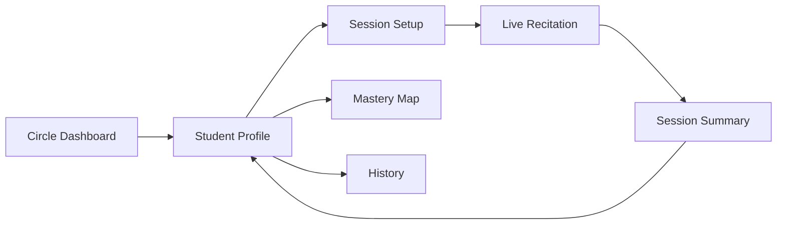
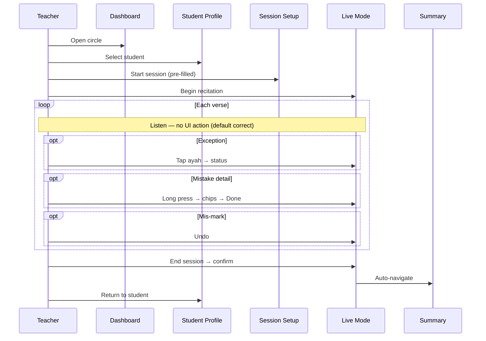
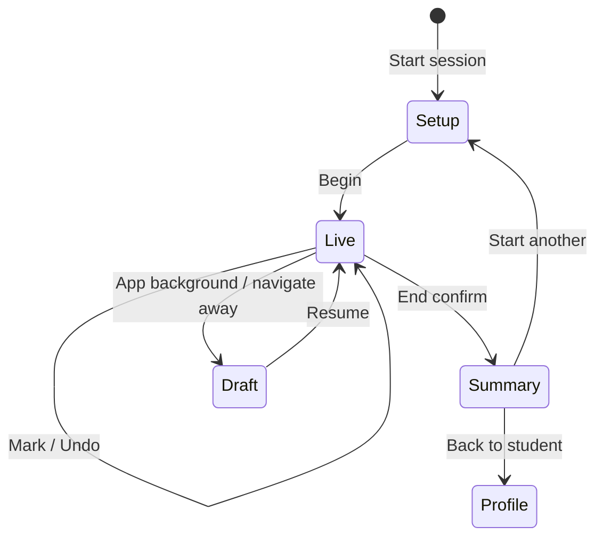

# Quran Circle Management Platform — UI/UX Specification

**Version:** 1.0  
**Status:** Approved — mock UI implementation in `web/` (no backend)  
**Sources:** `APP_DESIGN.md`, `IMPLEMENTATION_PLAN.md`  
**Register:** Product UI (teacher-facing app; admin panel out of scope for this document)

---

## Table of Contents

1. [Design Principles & Constraints](#1-design-principles--constraints)
2. [Information Architecture](#2-information-architecture)
3. [Live Recitation Mode — Deep Analysis](#3-live-recitation-mode--deep-analysis)
4. [Complete Teacher Session Flow](#4-complete-teacher-session-flow)
5. [Interaction Inventory](#5-interaction-inventory)
6. [Workflow Optimization](#6-workflow-optimization)
7. [Global Design System (Teacher App)](#7-global-design-system-teacher-app)
8. [Screen Specifications](#8-screen-specifications)
9. [Cross-Screen Navigation & States](#9-cross-screen-navigation--states)
10. [Accessibility & Responsive Strategy](#10-accessibility--responsive-strategy)
11. [Config-Driven UX Behaviors](#11-config-driven-ux-behaviors)
12. [Open UX Decisions](#12-open-ux-decisions)
13. [Intelligence & Insights](#13-intelligence--insights)

---

## 1. Design Principles & Constraints

### 1.1 North star

> **The teacher listens to the student. The app records exceptions quietly.**

Every screen, component, and interaction is judged against this sentence. If a feature pulls attention away from listening, it is deferred or redesigned.

### 1.2 Hierarchy of attention (during live session)

| Priority | What teacher focuses on | What the UI does |
|----------|-------------------------|------------------|
| 1 | Student's voice & recitation | Shows Quran passively; no animations, no alerts |
| 2 | Marking an exceptional verse | Single-gesture status capture |
| 3 | Adding mistake detail | 3rd tap opens panel; optional chip tags |
| 4 | Session control | Undo + End only in footer; no nav chrome |

### 1.3 Assumption model (critical)

- **All verses in range are `Correct` until explicitly marked otherwise.**
- Unmarked verses are **not stored** during the session; they are inferred at session end as correct for the recited range.
- The teacher never confirms correct verses — zero interaction for the common case.

### 1.4 Device & environment assumptions

| Context | Primary device | Lighting | Posture |
|---------|----------------|----------|---------|
| Live session | Tablet or phone (landscape preferred on tablet) | Classroom / masjid — variable | One hand on device, eyes mostly on student |
| Planning & review | Desktop or tablet | Office / home | Two hands, longer attention |

**Theme recommendation:** Light mode default for live session (paper-like Quran readability in bright rooms). Optional dark mode for planning screens. Admin-configurable via `display.theme_live`.

### 1.5 Cognitive load rules

- Max **2** visible actions in live mode footer.
- Max **5** status options in verse picker (matches taxonomy).
- Mistake panel: chips only — no free-text required during session.
- Numbers in header (timer, mistake count): peripheral vision only — small, muted.

---

## 2. Information Architecture

### 2.1 Teacher app route map

```
/login
/circles                          → Circle list (entry dashboard)
/circles/[id]                     → Circle detail + roster
/students/[id]                     → Student profile (hub)
/students/[id]/plan               → Memorization plan
/students/[id]/history            → Session history
/students/[id]/mastery-map        → Quran mastery map
/students/[id]/weak-ayat          → Repeated weak ayat (Phase 7)
/students/[id]/insights           → Weakness pattern analytics (Phase 7)
/students/[id]/review-plan        → Smart review planner (Phase 7)
/students/[id]/timeline           → Progress timeline (Phase 7)
/students/[id]/reports            → Parent report generator (Phase 7)
/session/new                      → Session setup
/session/[id]/live                → Live recitation mode ★
/session/[id]/summary             → Post-session summary
/settings                         → Teacher preferences (not admin config)
```

### 2.2 Primary user journeys



**Fastest path to live session (optimized):**

`Circle Dashboard` → tap student card → tap **Start Session** (plan pre-filled) → tap **Begin** → `Live Recitation`

Target: **3 taps** from student profile to live mode.

---

## 3. Live Recitation Mode — Deep Analysis

### 3.1 Role in the product

Live Recitation Mode is not a "feature screen" — it is **the product**. All other screens exist to set up, contextualize, or review what happens here. Design quality here determines adoption.

### 3.2 Jobs to be done (during session)

| Job | Frequency | Interaction budget |
|-----|-----------|-------------------|
| Read along with student (Quran display) | Continuous | 0 interactions |
| Mark verse that needed reminder | Occasional | ≤2 interactions |
| Mark verse needing second attempt / prompting / incomplete | Occasional | ≤2 interactions |
| Tag specific mistake types | Rare | 3rd tap + chip toggles + Done |
| Correct a mis-tap | Rare | 1 interaction (undo) |
| End session | Once | 2 interactions (tap + confirm) |

**Target interaction ratio:** For a 30-verse session with 4 exceptional verses, **≤12 interactions** total (excluding end session), vs. **30+** if every verse required a tap.

### 3.3 Screen regions (anatomy)

```
┌──────────────────────────────────────────────────────────────┐
│ REGION A: Session Chrome (sticky, 48–56px mobile / 56px desktop)│
│   Student · Surah · Ayah range · Timer · Exception count      │
├──────────────────────────────────────────────────────────────┤
│ REGION B: Quran Canvas (flex-grow, scrollable)                │
│   Display mode: Structured (rows) OR Mushaf (pages)           │
│   RTL Arabic · ayah markers · verse hit-targets               │
│   Only marked verses show status tint                         │
│ REGION B′: Display mode toggle (in chrome or above canvas)    │
│   [ Structured | Mushaf ] — instant switch, no state loss     │
├──────────────────────────────────────────────────────────────┤
│ REGION C: Tap hint strip (one line)                           │
│   "Tap: 2nd attempt → 3rd attempt → mistakes"               │
├──────────────────────────────────────────────────────────────┤
│ REGION D: Session Footer (sticky, 56–64px)                    │
│   [Undo]                              [End Session]           │
└──────────────────────────────────────────────────────────────┘

OVERLAY E: Mistakes Detail Panel (opens on 3rd tap — mistakes + note)
OVERLAY F: End Session Confirm (sheet / dialog)
```

### 3.4 Verse interaction model (attempt cycle — approved)

**No status picker. No long press.** Each tap on an ayah advances state immediately.

| Tap # | State (unmarked ayah) | Result |
|-------|----------------------|--------|
| **1st** | Unmarked | Immediately → `second_attempt` (orange tint) |
| **2nd** | `second_attempt` | Immediately → `third_attempt` (red tint) |
| **3rd** | `third_attempt` | Opens mistakes detail panel |
| **4th+** | Has mistakes / `third_attempt` | Reopens mistakes panel |

**To record mistakes only:** Teacher still taps 3 times (2nd → 3rd → panel). Status progression is the gate to mistakes — keeps one gesture vocabulary.

**Undo** reverts the last tap or panel save. There is no tap-to-clear; use Undo to step back through the cycle.

**Interaction budget per exceptional verse:**
- Status only (2nd + 3rd attempt): **2 taps**
- With mistakes: **3 taps + chip toggles + Done**

### 3.5 Passive behaviors (zero teacher input)

| Behavior | Trigger | Purpose |
|----------|---------|---------|
| Session timer | Auto-start on enter `/live` | Duration analytics |
| Auto-save draft | Every 10s + on each mark | No data loss |
| Exception counter | Increments on non-clear marks | Peripheral awareness |
| Scroll position restore | Return from panel | Continuity |
| Range-bound verses only | Session config | Reduce noise |
| Batch sync to server | Background | No blocking UI |

### 3.6 What Live Mode deliberately excludes

- Sidebar navigation (hidden / locked)
- Student switching mid-session
- Surah/range editing mid-session
- Notifications / toasts (except critical save failure — subtle banner)
- Mastery score (post-session only — avoid mid-session judgment)
- Audio recording (roadmap)

### 3.7 Failure & recovery

| Scenario | UX response |
|----------|---------------|
| Accidental tap | Undo (reverts last mark/panel save) |
| Accidental 3rd tap (panel opens) | Tap outside or swipe down to close without saving |
| Network loss | Continue locally; queue sync; subtle "Saving offline" in chrome |
| App backgrounded | Timer pauses; state persisted |
| Session idle 30+ min | Soft prompt: "Still reciting?" — no auto-end |

---

## 4. Complete Teacher Session Flow

### 4.1 Narrative walkthrough (real Fajr circle, 15 minutes)

**Context:** Ustadh Ahmad runs Youth Circle. Student Yusuf recites Surah Taha 57–80 (24 verses). Four verses need attention.

| Step | Time | Teacher action | Screen | Interactions |
|------|------|----------------|--------|--------------|
| 1 | T−5min | Opens app, lands on Fajr Circle dashboard | Dashboard | 0 (last circle remembered) |
| 2 | T−4min | Taps Yusuf's row | Dashboard → Student Profile | 1 tap |
| 3 | T−3min | Taps **Start Session** (plan pre-filled: Taha 57–80) | → Session Setup | 1 tap |
| 4 | T−2min | Reviews pre-filled range, taps **Begin Recitation** | → Live Mode | 1 tap |
| 5 | T−0 | Timer starts; Quran scrolls to ayah 57; listens | Live Mode | 0 |
| 6 | T+2min | Ayah 62: needed 2nd attempt only | Live Mode | **1 tap** |
| 7 | T+4min | Ayah 65: 2nd + 3rd + mistakes (Madd, Ghunnah) | Live Mode | 3 taps + 2 chips + Done = **6** |
| 8 | T+6min | Ayah 71: 2nd + 3rd attempt | Live Mode | **2 taps** |
| 9 | T+8min | Ayah 74: full cycle with hesitation tag | Live Mode | **3 taps** + chips + Done |
| 10 | T+10min | Student finishes ayah 80 | Live Mode | 0 |
| 11 | T+11min | Taps **End Session** → confirms | Live Mode | **2** |
| 12 | T+12min | Reviews summary, taps **Back to Yusuf** | Summary | 1 tap |

**Total interactions:** 3 (setup) + 10 (marking) + 2 (end) + 1 (exit) = **16** for 24 verses.  
**Correct verses:** 20 × **0** interactions = saved **20 taps** vs. per-verse tracking.

### 4.2 Flow diagram



### 4.3 Alternate entry paths

| Path | Steps | When used |
|------|-------|-----------|
| **Quick start** (recommended) | Profile → Start Session → Begin | Daily default |
| From plan page | Plan → Start with this range | Adjusting targets first |
| From circle roster | Roster → ⋮ → Start session | First session with new student |
| Resume draft | Banner "Resume session?" on profile | Interrupted session |

---

## 5. Interaction Inventory

### 5.1 Global gestures & inputs

| Input | Context | Result |
|-------|---------|--------|
| Tap | Button, link, card | Navigate or action |
| Tap (1st) | Ayah (live mode) | Mark 2nd attempt immediately |
| Tap (2nd) | Same ayah | Mark 3rd attempt immediately |
| Tap (3rd) | Same ayah | Open mistakes detail panel |
| Scroll / swipe vertical | Quran canvas | Scroll text |
| Swipe down | Detail panel | Dismiss panel |
| Tap outside | Mistakes panel | Close without saving |
| Keyboard `Z` / `Ctrl+Z` | Live mode desktop | Undo |
| Keyboard `Esc` | Overlays | Close overlay |
| Keyboard `1–4` | Live mode desktop | Quick-assign status to last tapped ayah |

### 5.2 Per-screen interaction counts (minimum path)

| Screen | Min interactions | Max interactions (heavy marking) |
|--------|------------------|----------------------------------|
| Dashboard | 1 (select student) | 3 (+ create circle) |
| Student Profile | 1 (start session) | 5 (+ edit plan, history) |
| Session Setup | 1 (begin) | 6 (change all fields manually) |
| Live Mode | 2 (end only) | 2 + (3–5 per exception verse) |
| Long-Press Panel | 2 (open + done) | 2 + N chips + note |
| Session Summary | 0 (read only) | 2 (add session note) |
| Mastery Map | 1 (open surah) | 4+ (drill-down) |

### 5.3 Live mode — exception verse interaction tree

```
Ayah tapped
├── Unmarked → 1st tap → second_attempt (immediate)
├── second_attempt → 2nd tap → third_attempt (immediate)
├── third_attempt → 3rd tap → open mistakes panel
│   ├── Toggle mistake chips (multi)
│   ├── Optional note (collapsed by default)
│   ├── Done → save tags, close
│   └── Cancel / swipe → close without saving new tags
└── Undo → revert last tap or panel save
```

---

## 6. Workflow Optimization

### 6.1 Optimizations (ranked by impact)

| # | Optimization | Saves | Phase |
|---|--------------|-------|-------|
| 1 | **Implicit correct** — no tap for good verses | ~90% of potential taps | MVP |
| 2 | **Plan pre-fill** on session setup | 3–5 setup taps | MVP |
| 3 | **Quick Start** from student profile | 1 navigation step | MVP |
| 4 | **3-tap attempt cycle** — no picker overlay | Zero decision UI during listen | MVP |
| 5 | **Undo** instead of tap-to-clear | Reduces error recovery cost | MVP |
| 6 | Mistake chips without mandatory note | 1 fewer field | MVP |
| 8 | Auto-save + offline queue | Prevents re-entry | Phase 5 |
| 9 | Resume interrupted session | Full setup avoided | Phase 5 |
| 10 | Desktop keyboard shortcuts | Power users | Phase 5 |

### 6.2 Session setup pre-fill logic

| Field | Pre-fill source | Editable |
|-------|-----------------|----------|
| Student | From navigation context | No (locked) |
| Surah | `MemorizationPlan.current_surah` | Yes |
| Start ayah | `current_start_ayah` | Yes |
| End ayah | `current_end_ayah` | Yes |
| Session label | Auto: "{Surah} {start}–{end}" | Optional |

Banner on setup: *"Using Yusuf's current memorization plan. Adjust if needed."*

### 6.3 End-of-session inference

On **End Session**, system computes:

- `verses_recited` = end_ayah − start_ayah + 1
- `exceptions` = explicitly marked verses
- `implicit_correct` = verses_recited − exceptions (stored in summary, not as individual rows)

This keeps the database lean and the live UI fast.

---

## 7. Global Design System (Teacher App)

### 7.1 Typography

| Role | Font | Size (mobile / desktop) |
|------|------|-------------------------|
| Quran text | Admin `display.quran_font` (default: Uthmani-compatible) | 22px / 26px |
| Ayah marker | System UI | 12px / 13px |
| Screen title | Sans (e.g. Inter, Source Sans 3) | 18px / 20px |
| Body | Sans | 15px / 16px |
| Live chrome | Sans, medium | 14px / 14px |

### 7.2 Color semantics (status & map)

| Token | Meaning | Live mode use |
|-------|---------|---------------|
| `--status-reminder` | Amber tint | Left border on ayah |
| `--status-second` | Orange tint | Left border |
| `--status-prompt` | Red tint | Left border |
| `--status-incomplete` | Gray-red | Left border + strikethrough marker |
| `--map-memorized` | Green 500 | Mastery map cells |
| `--map-review` | Yellow 500 | Mastery map |
| `--map-weak` | Red 400 | Mastery map |
| `--map-none` | Neutral 200 | Mastery map |

**Rule:** Status colors appear **only on marked verses** — canvas stays paper-white.

### 7.3 Spacing & touch targets

- Minimum touch target: **44×44px** (ayah hit area extends beyond glyph)
- Ayah vertical padding: 12px mobile / 10px desktop
- Footer buttons: full-height of Region D, min 48px width
- Panel chips: 40px height, 8px gap

### 7.4 Motion

- Status mark: 150ms background fade-in (no bounce)
- Panel: 250ms slide-up (mobile) / 200ms slide-in-right (desktop)
- Status tint: 150ms fade-in on 1st/2nd tap
- **Respect `prefers-reduced-motion`**

---

## 8. Screen Specifications

---

### 8.1 Dashboard (Circle List / Circle Detail)

**Route:** `/circles` and `/circles/[id]`  
**Combined here:** Circle list is the landing dashboard; circle detail extends it with roster.

#### Purpose

- Orient teacher: which circle am I in, who am I teaching today?
- Fastest path to **Start Session** for any student.
- Surface circle-level pulse (sessions this week, students needing review).

#### User actions

| Action | Input | Result |
|--------|-------|--------|
| Select circle | Tap circle card | → Circle detail / roster |
| Create circle | Tap + button | Modal → name → save |
| Select student | Tap student row | → Student profile |
| Quick session | Tap ▶ on student row | → Session setup (pre-filled) |
| Search student | Type in search | Filter roster |
| Switch circle | Tap circle switcher | → Circle list |

#### Components

- **App shell:** Top bar (logo, circle name, teacher avatar), optional sidebar on desktop
- **Circle card:** Name, student count, last session date, chevron
- **Roster table/list:** Avatar initials, name, mastery % badge, last session, ▶ quick start
- **Review alerts strip:** "3 students have review due" (Phase 4) — tap filters roster
- **Empty state:** Illustration + "Add your first student"
- **FAB (mobile):** Add student

#### Mobile layout

```
┌─────────────────────────┐
│ ☰  Youth Circle    👤   │
├─────────────────────────┤
│ 🔍 Search students...   │
├─────────────────────────┤
│ ⚠ 2 review due          │
├─────────────────────────┤
│ ┌─────────────────────┐ │
│ │ YS  Yusuf      78% ▶│ │
│ │     Taha · 2d ago   │ │
│ └─────────────────────┘ │
│ ┌─────────────────────┐ │
│ │ AM  Amina      91% ▶│ │
│ └─────────────────────┘ │
│         ...             │
├─────────────────────────┤
│              [+ Student]│
└─────────────────────────┘
```

#### Desktop layout

```
┌──────────┬──────────────────────────────────────────────┐
│ Sidebar  │  Youth Circle                    [+ Student] │
│          ├──────────────────────────────────────────────┤
│ Circles  │  🔍 Search    Filter: All | Review due       │
│ Students │──────────────────────────────────────────────│
│ Settings │  Name        Mastery   Last session   Act.  │
│          │  Yusuf        78%      2 days ago      ▶ ··· │
│          │  Amina        91%      Today           ▶ ··· │
└──────────┴──────────────────────────────────────────────┘
```

#### Edge cases

| Case | Behavior |
|------|----------|
| No circles | Onboarding: create first circle CTA |
| No students in circle | Empty roster + add student |
| Archived student | Hidden by default; toggle "Show archived" |
| Unsaved draft session exists | Row badge "Draft" + resume on ▶ |
| Many students (50+) | Virtualized list; search prominent |

---

### 8.2 Student Profile

**Route:** `/students/[id]`

#### Purpose

- Single hub for one student's memorization journey.
- Answer: *Where are they now? How are they doing? What's next?*
- Primary CTA: **Start Session**.

#### User actions

| Action | Input | Result |
|--------|-------|--------|
| Start session | Tap primary CTA | → Session setup (pre-filled) |
| View plan | Tap plan card / Edit | → Plan page |
| View history | Tap session row / See all | → History |
| View mastery map | Tap map preview / Open full | → Mastery map |
| Add note | Tap notes → add | Student-level note modal |
| Edit student | Tap ··· menu | Edit / archive |

#### Components

- **Header:** Name, circle, contact (collapsed), ··· menu
- **Hero CTA:** `Start Session` (full-width mobile, prominent)
- **Mastery ring:** Overall % with trend arrow
- **Plan summary card:** Current / Next / Review chips
- **Stats row:** Total verses, sessions, common mistake
- **Recent sessions list:** Last 3 — date, range, score, mistake count
- **Mastery map thumbnail:** Mini heatmap — tap to expand
- **Review recommendations:** Top 3 passages (Phase 4)

#### Mobile layout

```
┌─────────────────────────┐
│ ←  Yusuf            ··· │
├─────────────────────────┤
│     ┌─────────┐         │
│     │  78%    │  ↑ +4%  │
│     │ mastery │         │
│     └─────────┘         │
│  ┌─────────────────────┐│
│  │   ▶ START SESSION   ││
│  └─────────────────────┘│
├─────────────────────────┤
│ Current: Taha 57–134    │
│ Next: Taha 135–200      │
│ Review: Al-A'la · ...   │  → Edit plan
├─────────────────────────┤
│ [mini mastery map]      │
├─────────────────────────┤
│ Recent sessions         │
│ · Today  Taha 45-60  82%│
│ · Mon    Taha 30-44  75%│
└─────────────────────────┘
```

#### Desktop layout

Two-column: left (identity + CTA + plan), right (stats + map + sessions).

```
┌────────────────────────────────────────────────────────────┐
│ ← Youth Circle / Yusuf                         [Start Session]│
├──────────────────────────┬─────────────────────────────────┤
│ Mastery 78% (↑4%)        │  [Mastery map preview — wider]  │
│ Plan summary             │                                 │
│ Notes                    │  Recent sessions table          │
│                          │  Analytics sparkline            │
└──────────────────────────┴─────────────────────────────────┘
```

#### Edge cases

| Case | Behavior |
|------|----------|
| New student (no sessions) | Empty stats; plan CTA; map all gray |
| Draft session exists | Banner above CTA: "Resume session" / "Discard" |
| No plan configured | Setup prompts plan before first session (skippable) |
| Very long review list | Show 3 + "View all on plan page" |

---

### 8.3 Session Setup

**Route:** `/session/new` (with query/context: `studentId`)

#### Purpose

- Confirm **who**, **which passages**, and **how much** before live mode.
- Support **multiple surahs**, each with its own from–to ayah range (e.g. new hifz + review).
- Last checkpoint before locking attention on listening.
- Should take **<15 seconds** with plan pre-fill (current + review targets).

#### User actions

| Action | Input | Result |
|--------|-------|--------|
| Edit passage | Surah picker + from/to per row | Updates one range |
| Add passage | Tap "+ Add another surah" | New empty range row |
| Remove passage | Tap Remove (when ≥2 rows) | Deletes range row |
| Use plan defaults | Tap reset link | Current plan + review targets as separate rows |
| Begin | Tap primary CTA | Create session → Live mode |
| Cancel | Tap back | → Student profile, no session |

#### Components

- **Student chip:** Name (locked)
- **Passage list:** Repeatable cards — surah select + from/to per passage
- **Add passage button:** Appends new surah range row
- **Totals line:** "42 verses across 3 passages"
- **Plan hint banner:** Pre-fill from current + review
- **Primary CTA:** `Begin Recitation`

#### Mobile layout

```
┌─────────────────────────┐
│ ←  Session Setup        │
├─────────────────────────┤
│ Student: Yusuf          │
├─────────────────────────┤
│ Passage 1               │
│ Surah Taha (20)      ▼  │
│ From [57]  To [80]      │
│ 24 verses               │
├─────────────────────────┤
│ Passage 2          [×]  │
│ Surah Al-A'la (87)   ▼  │
│ From [1]   To [19]      │
│ 19 verses               │
├─────────────────────────┤
│ [+ Add another surah]   │
│ 43 verses · 2 passages  │
├─────────────────────────┤
│ ℹ From plan [Reset]     │
├─────────────────────────┤
│ [ BEGIN RECITATION ]    │
└─────────────────────────┘
```

#### Desktop layout

Centered card (max 520px) — stacked passage cards, same fields.

#### Edge cases

| Case | Behavior |
|------|----------|
| end < start on any row | That row invalid; CTA disabled |
| Only one passage | Remove button hidden |
| Duplicate surah ranges | Allowed (e.g. Taha 1–20 and Taha 50–60) |
| Total > 100 verses | Warning: "Long session" (non-blocking) |
| Single ayah per row | start = end allowed |
| Student has no plan | One empty passage row |
| Concurrent draft | Prompt: resume or replace |

---

### 8.4 Live Recitation Mode ★

**Route:** `/session/[id]/live`

#### Purpose

- Primary teaching screen.
- Display Quran; capture exceptions with minimal gestures.
- Never require navigation away until session ends.

#### User actions

| Action | Input | Result |
|--------|-------|--------|
| Scroll Quran | Swipe / scroll | Move through ayahs |
| Mark 2nd attempt | 1st tap on ayah | Immediate orange tint |
| Mark 3rd attempt | 2nd tap on same ayah | Immediate red tint |
| Add mistakes | 3rd tap on same ayah | Open detail panel |
| Undo | Tap Undo | Revert last mark/tag save |
| End session | Tap End → Confirm | → Summary |
| Pause timer | Optional: tap timer | Timer pause (admin flag) |

#### Components

- **Session chrome (A):** Student name, passage summary (N passages · M verses), timer, exception count
- **Tap hint strip (C):** One-line reminder of 3-tap cycle
- **Display mode toggle:** Segmented `Structured | Mushaf` in session chrome
- **Quran canvas (B):** `QuranDisplay` — Structured rows OR Mushaf page; RTL; ayah hit-targets; status tints
- **Footer (D):** Undo (disabled when stack empty), End Session (destructive outline)
- **Mistakes panel (E):** Opens on 3rd tap; bottom sheet (mobile) / side panel (desktop)

#### Mobile layout (portrait)

```
┌─────────────────────────┐
│ Yusuf·Taha 57-80  4:02 ⨯3│
├─────────────────────────┤
│                         │
│  بِسْمِ اللَّهِ ...       │
│  ┌───────────────────┐  │
│  │ 57 │ verse text   │  │ ← marked: amber border
│  └───────────────────┘  │
│  ┌───────────────────┐  │
│  │ 58 │ verse text   │  │
│  └───────────────────┘  │
│         ...             │
├─────────────────────────┤
│ Tap: 2nd → 3rd → mistakes│
├─────────────────────────┤
│ [Undo]      [End Session]│
└─────────────────────────┘
```

#### Desktop layout

```
┌────────────────────────────────────────────────────────────────┐
│ Yusuf · Surah Taha (57–80)     ⏱ 4:02     Exceptions: 3      │
├────────────────────────────────────────────────────────────────┤
│ Tap ayah: 2nd attempt → 3rd attempt → mistakes               │
├────────────────────────────────────────────────────────────────┤
│                    Quran canvas (max-width 720px, centered)    │
├────────────────────────────────────────────────────────────────┤
│ [Undo]                                    [End Session]        │
└────────────────────────────────────────────────────────────────┘
```

#### Edge cases

| Case | Behavior |
|------|----------|
| No marks entire session | End still valid; summary shows 100% implicit |
| All verses marked | Allowed; heavy session |
| Undo exhausted | Button disabled; tooltip "Nothing to undo" |
| Rapid taps | Each tap advances cycle; Undo steps back one step |
| 3rd tap opens panel accidentally | Close panel without Done; status stays at 3rd attempt |
| Leave mid-session (back gesture) | Confirm: "Leave session? Progress saved." |
| Exception count | Counts verses with non-clear status + verses with mistake tags only |
| Very long range (50+ ayahs) | Virtualized list; scroll-to-start on enter |
| Font too small | Pinch-zoom on canvas only (admin can set default size) |

---

### 8.5 Mistakes Detail Panel (3rd Tap)

**Overlay on Live Mode** — not a separate route.

#### Purpose

- Capture **mistake taxonomy** and optional notes after 2nd and 3rd attempt are recorded.
- Opens on **3rd tap** of the same ayah (replaces long press).
- Keeps listening flow: tap → tap → tap → chips → Done.

#### User actions

| Action | Input | Result |
|--------|-------|--------|
| Open | 3rd tap on ayah (at `third_attempt`) | Panel slides in; ayah context shown |
| Toggle mistake | Tap chip | Multi-select toggle |
| Add note | Tap "Add note" expander | Text area (optional) |
| Save & close | Tap Done / swipe down | Persist tags; close |
| Cancel | Tap X or outside | Close; unsaved chip changes discarded (confirm if dirty) |

#### Components

- **Ayah context header:** Surah name, ayah number, Arabic snippet (1 line)
- **Category sections:** Memorization | Tajweed | Behavior — collapsible
- **Mistake chips:** From admin taxonomy; multi-select; checkmark on active
- **Note field:** Collapsed by default; expands on tap
- **Done button:** Primary, full-width mobile
- **Existing tags indicator:** If re-opening marked ayah, show prior chips selected

#### Mobile layout (bottom sheet)

```
┌─────────────────────────┐
│ ─── (drag handle)       │
│ Ayah 65 · Surah Taha    │
│ ٱلْخَلْقِ ...            │
├─────────────────────────┤
│ Memorization            │
│ [Forgotten word] [Verse]│
│ Tajweed                 │
│ [Madd] [Ghunnah] [Noon] │
│ Behavior                │
│ [Hesitation]            │
├─────────────────────────┤
│ + Add note (optional)   │
├─────────────────────────┤
│ ┌─────────────────────┐ │
│ │       Done          │ │
│ └─────────────────────┘ │
└─────────────────────────┘
```

Sheet height: 55vh max; scrollable chip area.

#### Desktop layout (right side panel, 360px)

```
┌──────────────────────────────┬─────────────────┐
│                              │ Ayah 65 · Taha  │
│      Quran (dimmed 10%)      │ ─────────────── │
│                              │ Memorization    │
│                              │ [chips...]      │
│                              │ Tajweed         │
│                              │ [chips...]      │
│                              │ [Done]          │
└──────────────────────────────┴─────────────────┘
```

Quran remains visible and scrollable; panel does not cover canvas on desktop.

#### Edge cases

| Case | Behavior |
|------|----------|
| No chips selected, Done | Close; no mistake records (status unaffected) |
| 10+ chips selected | Allowed; scroll chip area |
| Note only, no chips | Save note attached to ayah record |
| 3rd tap without prior attempts | Should not occur — panel only opens at `third_attempt` |
| Admin deactivated a chip | Hidden in UI; historical sessions retain slug |
| Dirty close | "Discard changes?" if chips toggled |

---

### 8.6 Session Summary

**Route:** `/session/[id]/summary`

#### Purpose

- Immediate feedback after session — reward loop for teacher.
- Confirm what was captured before returning to planning.
- Optional: session-level note.

#### User actions

| Action | Input | Result |
|--------|-------|--------|
| View breakdown | Scroll | See stats |
| Add session note | Tap add note | Text field → save |
| Back to student | Tap primary CTA | → Student profile |
| Start another | Tap secondary CTA | → Session setup (same student) |
| View marked verses | Tap exception list | Expand ayah list with statuses |

#### Components

- **Success header:** "Session complete" + duration
- **Mastery score card:** Large % for this session
- **Stat grid:** Verses recited, exceptions, reminders, prompts, incomplete, mistake tags
- **Mistake breakdown:** Horizontal bar chart by category
- **Marked verses list:** Collapsible — ayah #, status, mistake icons
- **Session note:** Optional text
- **CTAs:** Back to student (primary), Start another (secondary)

#### Mobile layout

```
┌─────────────────────────┐
│      ✓ Session complete │
│      12 min · Taha 57-80│
├─────────────────────────┤
│      ┌─────────┐        │
│      │   82%   │        │
│      │ session │        │
│      │ mastery │        │
│      └─────────┘        │
├─────────────────────────┤
│ 24 verses · 4 exceptions│
│ Reminders: 1            │
│ 2nd attempts: 1         │
│ Prompts: 1              │
├─────────────────────────┤
│ Mistakes by type        │
│ █████ Tajweed 60%       │
│ ███ Mem 30%             │
├─────────────────────────┤
│ ▼ Marked verses (4)     │
├─────────────────────────┤
│ [Back to Yusuf]         │
│ [Start another session] │
└─────────────────────────┘
```

#### Desktop layout

Two-column: left = score + stats, right = chart + marked list.

#### Edge cases

| Case | Behavior |
|------|----------|
| Perfect session (0 exceptions) | Celebrate copy: "All verses fluent — nothing to mark" |
| Save still pending | Spinner on score; "Calculating..." |
| Save failed | Error banner + retry; data in local queue |
| Very many marks | Marked list paginated |

---

### 8.7 Quran Mastery Map

**Route:** `/students/[id]/mastery-map`

#### Purpose

- Visual answer: *What has this student mastered, and where are the gaps?*
- Guide review planning and conversation with parents/supervisors.
- Drill from 114 surahs → ayah-level detail.

#### User actions

| Action | Input | Result |
|--------|-------|--------|
| Browse surahs | Scroll grid/list | See color-coded surah cells |
| Filter by state | Tap legend filter | Dim non-matching |
| Open surah | Tap surah cell | → Ayah-level view |
| Open ayah detail | Tap ayah cell | Bottom sheet: score, last recited, mistakes |
| Jump to session | Tap "Practice this" | → Session setup pre-filled |
| Toggle juz view | Tap juz / surah toggle | Re-group visualization |
| Zoom (desktop) | Scroll wheel on grid | Density change |

#### Components

- **Header:** Student name, overall mastery %, back link
- **View toggle:** Surah grid | Juz overview
- **Legend:** Memorized | Needs review | Frequently weak | Not recited
- **Surah grid:** 114 cells — color by aggregate surah state (worst ayah wins or avg — configurable)
- **Ayah grid:** Per-surah masonry or row wrap
- **Detail sheet:** Ayah #, state, score, last session date, top mistakes
- **CTA in sheet:** Start session with this ayah in range

#### Mobile layout (surah grid)

```
┌─────────────────────────┐
│ ← Mastery Map · Yusuf   │
│ Overall 78%    [Juz|Surah]│
├─────────────────────────┤
│ ■ Mem  ■ Review  ■ Weak  ■ None │
├─────────────────────────┤
│ ┌──┬──┬──┬──┬──┐        │
│ │1 │2 │3 │4 │5 │  ...   │
│ ├──┼──┼──┼──┼──┤        │
│ │  green / yellow / red / gray cells      │
│ └──┴──┴──┴──┴──┘        │
│         ...             │
├─────────────────────────┤
│ Tap surah for ayah view │
└─────────────────────────┘
```

#### Mobile layout (ayah detail — Surah Taha)

```
┌─────────────────────────┐
│ ← Taha (20)             │
├─────────────────────────┤
│ Ayah cells 1–135 in rows│
│ [1][2][3][4][5][6][7]...│
│ green yellow red gray   │
├─────────────────────────┤
│ Ayah 65 · Needs review  │
│ Score 72 · 3 days ago   │
│ Top: Madd, Hesitation   │
│ [Start session here]    │
└─────────────────────────┘
```

#### Desktop layout

```
┌────────────────────────────────────────────────────────────┐
│ Yusuf — Mastery Map          [Surah view ▼]  Overall 78% │
├────────┬───────────────────────────────────────────────────┤
│ Legend │  Surah grid (12 cols) or ayah grid when selected   │
│ filters│                                                   │
│        │  ┌─────────────────────────────────────────────┐  │
│        │  │ Selected: Taha — Ayah 65 detail panel       │  │
│        │  └─────────────────────────────────────────────┘  │
└────────┴───────────────────────────────────────────────────┘
```

#### Edge cases

| Case | Behavior |
|------|----------|
| No data (new student) | All gray; copy explains map fills after sessions |
| Partial surah (only some ayahs recited) | Per-ayah colors; unrecited ayahs gray |
| 114 surahs on small phone | Scroll; optional compact mode (smaller cells) |
| Surah with 286 ayahs | Virtualized ayah grid |
| State thresholds change (admin) | Map refreshes on next load; legend shows current rules |

---

## 9. Cross-Screen Navigation & States

### 9.1 Session state machine



### 9.2 Loading & empty states (global)

| State | Pattern |
|-------|---------|
| Loading | Skeleton screens — no spinners on live mode |
| Error | Inline retry + preserved local draft |
| Empty | One-line explanation + single CTA |
| Offline | Banner in app shell; live mode fully functional |

### 9.3 Notifications (teacher app)

**None during live session.** Outside live mode: subtle badges for review due count only.

---

## 10. Accessibility & Responsive Strategy

### 10.1 Accessibility

- WCAG 2.1 AA contrast on all chrome (Quran text follows readable font size, not contrast rules on glyphs)
- Ayah hit-targets: min 44px regardless of glyph size
- Mistakes panel: keyboard navigable (Tab through chips)
- Screen reader: ayah announced as "Ayah 57, Surah Taha, marked reminder required"
- Focus trap in detail panel and end-session confirm
- `prefers-reduced-motion`: instant state changes, no slide animations

### 10.2 Breakpoints

| Breakpoint | Width | Layout behavior |
|------------|-------|-----------------|
| Mobile S | <375px | Compact chrome; full-width mistakes bottom sheet |
| Mobile | 375–767px | Bottom sheets; portrait live mode |
| Tablet | 768–1023px | Landscape live mode preferred; side panel for detail |
| Desktop | ≥1024px | Sidebar shell; keyboard shortcuts in live mode |

### 10.3 Mobile S fallback

---

## 11. Config-Driven UX Behaviors

These admin-controlled keys directly affect teacher UI (see `IMPLEMENTATION_PLAN.md` §8.2):

| Key | Default | UI effect |
|-----|---------|-----------|
| `live.tap_mode` | attempt_cycle | 1st tap = 2nd attempt; 2nd = 3rd; 3rd = mistakes panel |
| `live.undo_depth` | 10 | Undo stack size |
| `live.auto_start_timer` | true | Timer on live enter |
| `display.quran_font` | Uthmani | Structured mode typography |
| `display.quran_font_size` | 22 | Structured mode font size |
| `display.theme_live` | light | Live mode color scheme |
| `display.quran_mode` | structured | Teacher default: `structured` \| `mushaf` |
| `features.mushaf_display` | true | Hide Mushaf toggle when off |
| VerseStatusDefinition.* | seeded | Picker labels, colors, order |
| MistakeSubcategory.* | seeded | Detail panel chips |

Teacher app fetches via `GET /config/active` on load and before each session.

---

## 12. Open UX Decisions

Confirm before implementation:

| # | Decision | Recommendation |
|---|----------|----------------|
| 1 | Tap interaction model | **Resolved** — 3-tap attempt cycle (no picker) |
| 2 | Landscape lock prompt on tablet? | Soft suggestion first time |
| 4 | End session require confirm? | **Yes** — prevent accidental end |
| 5 | Show exception count in chrome? | **Yes** — replaces "mistake count" label (includes all non-correct) |
| 6 | Mastery map MVP: surah or ayah level? | **Surah grid** + ayah drill-down |
| 7 | Session summary: auto-navigate or manual? | **Auto** after end confirm |
| 8 | Bilingual UI labels (AR/EN)? | English chrome; Arabic Quran + surah names |
| 9 | Pinch-zoom on Quran canvas? | **Yes** mobile only |
| 10 | Imperfect session note prompt? | Optional collapsed field on summary only |

---

## Approval

This document defines the UI/UX contract for the teacher-facing MVP. On approval:

1. Visual design (Figma or high-fidelity mockups) can follow this spec.
2. Component inventory can be derived for engineering.
3. Phase 2 (Live Recitation) implementation begins against §8.4 and §8.5.

**Please review and approve, or note requested changes.**

---

## 13. Quran Display Modes (M8)

Teachers toggle between **Structured** (tracking-optimized) and **Mushaf** (page-authentic) layouts in live recitation. The 3-tap interaction model, mistakes panel, and undo stack are identical in both modes.

### 13.1 Mode comparison

| Aspect | Structured Mode | Mushaf Mode |
|--------|-----------------|-------------|
| Layout | One ayah per row | Madinah page (15 lines typical) |
| Navigation | Vertical scroll | Page prev/next within session range |
| Ayah markers | LTR number in margin | Inline Arabic end markers in text |
| Status highlight | Left border + label chip | Soft background tint on ayah span |
| Typography | Admin `display.quran_font` | KFGQPC Uthmanic Hafs (fixed) |
| Best for | Fast exception marking | Natural read-along with student |

### 13.2 Live chrome additions (Mushaf active)

```
┌──────────────────────────────────────────────────────────────┐
│ Yusuf · Taha 57–80        ⏱ 4:02   ⨯3   [Structured|Mushaf]│
├──────────────────────────────────────────────────────────────┤
│                    ┌─────────────────────┐                   │
│                    │  سُورَةُ طه          │  ← surah header   │
│                    │  بِسْمِ اللَّهِ ...    │                   │
│                    │  ... continuous ...   │  ← Mushaf page    │
│                    │  inline ۝ markers     │                   │
│                    └─────────────────────┘                   │
│              ←  صفحة ٣١٢  →    (page nav, session bounds)    │
├──────────────────────────────────────────────────────────────┤
│ Tap ayah: 2nd attempt → 3rd attempt → mistakes               │
├──────────────────────────────────────────────────────────────┤
│ [Undo]                                    [End Session]      │
└──────────────────────────────────────────────────────────────┘
```

### 13.3 Mushaf interaction rules

| Rule | Behavior |
|------|----------|
| Tap target | Entire ayah span (all words sharing `surah:ayah`) is one hit target |
| Out-of-range ayat | **Dimmed (40% opacity) + disabled** — not hidden; page layout preserved |
| Marked ayah | Translucent amber (2nd) / rose (3rd) background — no box borders |
| Page bounds | Nav clamped to pages intersecting session `ranges` |
| Mode switch | Preserves `marks`, `undo` stack, timer; restores last page/scroll per mode |
| Pinch-zoom | Supported mobile-only (existing §12 decision #9) |

### 13.4 Settings

**Route:** `/settings` → **Quran display** card

- Default mode: Structured / Mushaf (radio)
- Persists to `user_preferences.quran_display_mode` (server) + localStorage cache for instant live load

### 13.5 Accessibility

- Each ayah span: `aria-label="{surah} ayah {n}, {status}"`
- Page nav buttons: `aria-label="Previous Mushaf page"` / `Next`
- Mode toggle: `role="tablist"` with `aria-selected`

### 13.6 Technical renderer (implementation contract)

- **Data:** `mushaf-layout` JSON (604 pages) bundled under `web/public/mushaf/`
- **Index:** Build-time `ayah-to-page.json` mapping `(surah, ayah) → page number`
- **Component tree:** `LiveSession` → `QuranDisplay` → `StructuredCanvas` \| `MushafCanvas`
- **Font:** `react-quran/fonts/index.css` (KFGQPC Hafs) or equivalent KFGQPC bundle
- **Not in scope:** Word-by-word tafseer, translation overlay, multiple riwayat

---

## 14. Intelligence & Insights

Post-MVP feature set (Phase 7). Extends student profile, session setup, and summary with analytics-first surfaces. Live Recitation Mode interaction model is unchanged.

---

### 13.1 Repeated Weak Ayat Engine

#### Purpose

Show teachers which ayat recur as problem areas across all sessions, ranked and drillable.

#### Problem it solves

Session history and mastery map do not answer *"which ayat fail most often over time?"* in one glance.

#### Detailed feature description

Ranked list per student: surah, ayah, total mistakes, last occurrence, persistence flag. Drill-down reveals chronological recitation events (session link, status, mistake chips).

#### User workflow

Profile → **Weak ayat** → scan ranked list → tap ayah → event timeline → *Start review here* or open source session.

#### UI/UX requirements

- Route: `/students/[id]/weak-ayat`
- Profile widget: top 3 weak ayat + "View all"
- Row: surah EN name, ayah #, mistake badge, relative date
- Persistent weak ayahs: warning accent (border or icon)
- Drill-down: bottom sheet / 360px side panel with scrollable events
- Empty state + loading skeleton
- Feature flag: `features.weak_ayat_engine`

#### Expected outputs

```
Most Problematic Ayat:
- Taha 64 (8 mistakes)
- Taha 109 (6 mistakes)
- Al-Baqarah 255 (5 mistakes)
```

#### Benefits

Targets review on proven weak spots; links map colors to evidence.

---

### 13.2 Weak Ayah Review Session Generator

#### Purpose

Convert weak ayat into editable review session ranges automatically.

#### Problem it solves

Teachers manually build ranges from scattered weak ayah numbers.

#### Detailed feature description

Clusters nearby weak ayahs per surah; pads for context; outputs passage preview. Sessions tagged **Review** vs **Regular** in setup, history, and summary.

#### User workflow

Weak ayat page → **Generate review** → adjust passages on preview (reuse §8.3 passage cards) → **Begin review** → live mode.

#### UI/UX requirements

- Preview screen between generator and live mode
- Session setup badge: `Review session` | `Regular session`
- History type chip on session rows
- Warning if total verses > 80 (non-blocking)
- CTA on profile when ≥3 persistent weak ayahs

#### Expected outputs

```
Weak ayat: Taha 64, Taha 109 → Generated: Taha 60–110
```

#### Benefits

Faster review prep; natural grouping; auditable session types.

---

### 13.3 Smart Review Planner

#### Purpose

Daily and weekly prioritized review lists with scores and time estimates.

#### Problem it solves

Existing review recommendations (§8.2 profile) lack time-boxing and weekly scheduling.

#### Detailed feature description

Priority scores from mastery, mistakes, staleness, weak-ayat rank, trend. Today's top 3–5 items + weekly grid with suggested slots and estimated minutes.

#### User workflow

Profile **Review plan** strip → today's list → tap item → session setup → optional **Start today's plan** (multi-passage).

#### UI/UX requirements

- Route: `/students/[id]/review-plan`
- Numbered list with priority score (0–100) and reason chips
- Weekly: horizontal scroll (mobile) / 7-column grid (desktop)
- Circle dashboard: *"N students have review due today"*
- Distinct visual treatment from M4 review recommendations block

#### Expected outputs

```
Today's Review Plan:
1. Al-Ghashiyah (Priority 94)
2. At-Tariq (Priority 86)
3. Taha 57–80 (Priority 80)
```

#### Benefits

Consistent prioritization; time budgeting for circle length.

---

### 13.4 Weakness Pattern Analytics

#### Purpose

Category-level mistake patterns with trends over time.

#### Problem it solves

Per-session charts do not show longitudinal patterns like chronic hesitation or similar-verse confusion.

#### Detailed feature description

Donut/bar charts for memorization, tajweed, behavior. Top subcategory per category with %. Trend vs prior period. Drill to affected ayat list.

#### User workflow

Profile → **Insights** → select 30/90/365 days → read charts → drill subcategory → ayah list.

#### UI/UX requirements

- Route: `/students/[id]/insights`
- Three highlight cards (memorization / tajweed / behavior top issue)
- Trend arrows with percentage point delta
- WCAG: labels + percentages, not color-only
- Feed data into parent report preview (§13.5)

#### Expected outputs

```
Similar Verse Confusion (38%) · Madd (27%) · Hesitation (41%)
```

#### Benefits

Pattern-aware teaching; measurable intervention impact.

---

### 13.5 Parent Report Generator

#### Purpose

Professional parent-facing reports with PDF, print, and share link.

#### Problem it solves

Ad-hoc parent updates are inconsistent and time-consuming.

#### Detailed feature description

Monthly or custom range. Sections: memorized/reviewed verses, sessions, mastery, strengths, improvements, curated teacher notes. WYSIWYG preview.

#### User workflow

`/students/[id]/reports` → pick period → preview → toggle notes → Export PDF / Print / Copy link.

#### UI/UX requirements

- A4 print stylesheet; preview matches export
- Share link: read-only, optional expiry, minimal PII
- Sticky export footer on mobile
- Watermark: platform name + generation date

#### Expected outputs

```
Student: Yusuf · June 2026 · Memorized: 48 · Reviewed: 180 · Mastery: 89%
```

#### Benefits

Saves teacher time; improves parent trust.

---

### 13.6 Progress Timeline

#### Purpose

Chronological milestone narrative plus optional activity heatmap.

#### Problem it solves

Session tables lack story; parents ask *"what did they achieve this term?"*

#### Detailed feature description

Monthly grouped events: surah started/completed, juz milestones, mastery gains, review milestones. Optional GitHub-style 12-month session heatmap.

#### User workflow

`/students/[id]/timeline` → scroll milestones → tap for contributing sessions → embed excerpt in parent report.

#### UI/UX requirements

- Vertical timeline with month headers and type icons
- Heatmap toggle; 7×52 grid with intensity legend
- `prefers-reduced-motion`: no scroll-reveal animations
- Empty months collapsible

#### Expected outputs

```
Jan: Started Taha · Feb: Completed Taha · Apr: Completed Juz 30
```

#### Benefits

Motivation narrative; meeting prep; consistency at a glance.

---

### 13.7 AI Session Summary (Future Feature)

#### Purpose

Natural-language post-session insights for teachers and parents.

#### Problem it solves

Manual synthesis after each session; parents need readable prose.

#### Detailed feature description

Async LLM card on summary page: performance summary, main challenge, review suggestion, trend vs recent sessions. Editable before save. Admin feature flag off by default.

#### User workflow

End session → summary → AI card loads → teacher edits → save to session note or parent report.

#### UI/UX requirements

- Card on §8.6 summary below mastery chart
- Shimmer loading; clear *AI-generated — review before sharing*
- Teacher opt-out in settings
- No AI UI during live mode

#### Expected outputs

```
Strong memorization today. Main challenge: Similar verse confusion.
Recommended review: Taha 60–90. +8% vs recent sessions.
```

#### Benefits

Faster debrief; foundation for AI-assisted teaching.

**Status:** Future — Phase 7b or later.

---

### 13.8 Intelligence hub on student profile (integration)

Extend §8.2 Student Profile with an **Insights** section (desktop: right column; mobile: below mastery map):

| Block | Content |
|-------|---------|
| Weak ayat (top 3) | Link to §13.1 |
| Review plan today | Link to §13.3 |
| Pattern snapshot | Top issue per category — link to §13.4 |
| Timeline teaser | Latest milestone — link to §13.6 |
| Parent report | Last generated / *Create report* — link to §13.5 |

Primary CTA **Start Session** remains unchanged; intelligence blocks are secondary.

---

*Generated from `IMPLEMENTATION_PLAN.md` and `APP_DESIGN.md`. No code included.*
