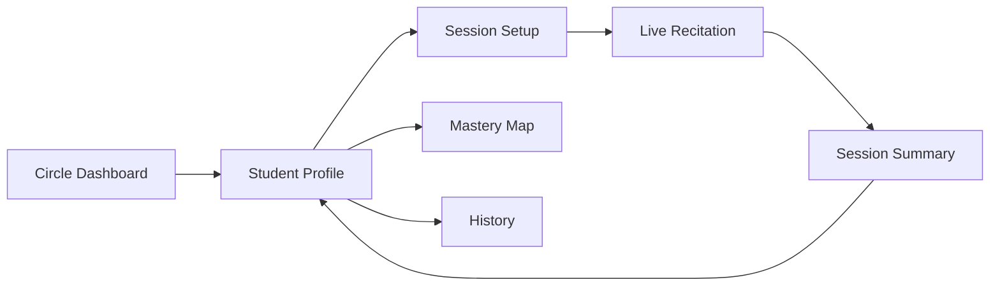
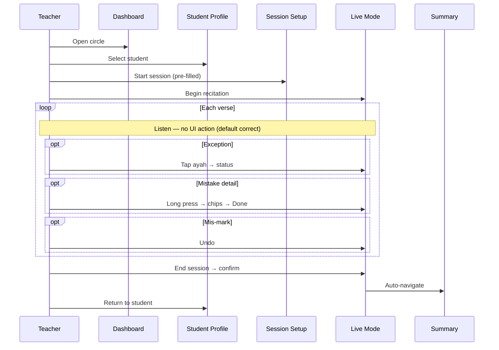
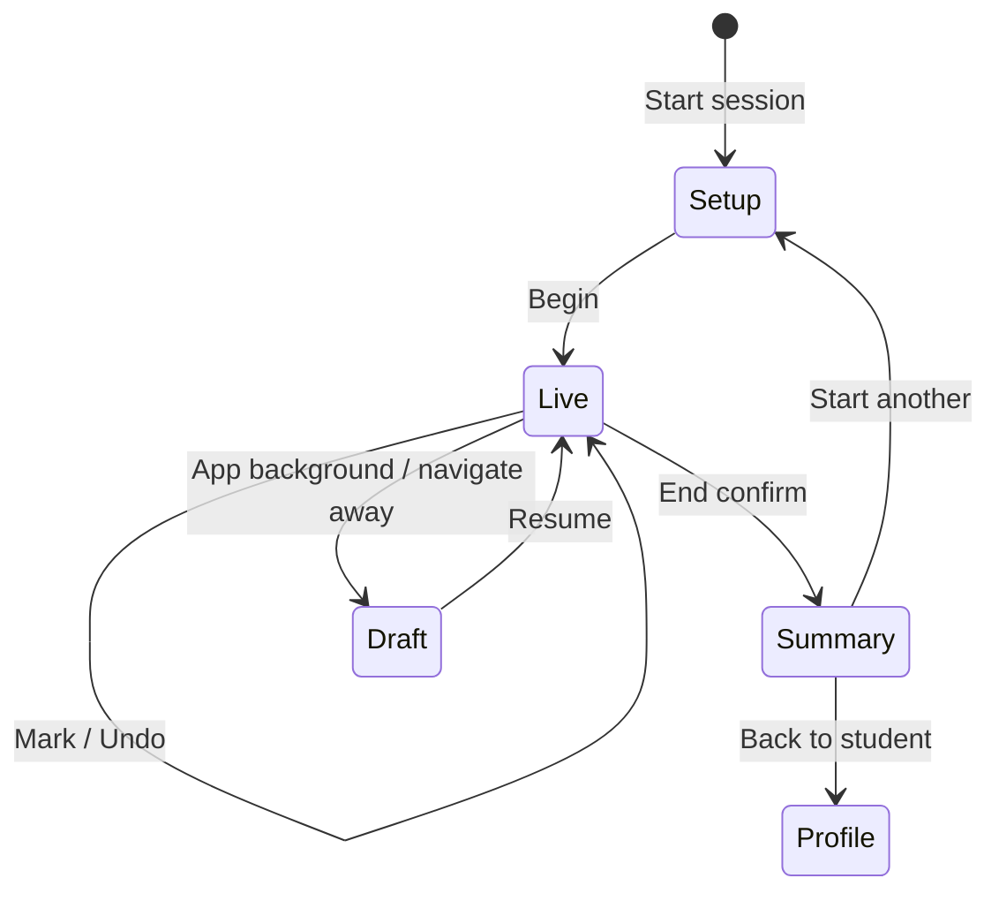

# Quran Circle Management Platform — UI/UX Specification

**Version:** 1.0 (draft)  
**Status:** Awaiting approval — no code to be written until signed off  
**Sources:** `APP_DESIGN.md`, `IMPLEMENTATION_PLAN.md`  
**Register:** Product UI (teacher-facing app; admin panel out of scope for this document)

---

## Table of Contents

1. [Design Principles & Constraints](#1-design-principles--constraints)
2. [Information Architecture](#2-information-architecture)
3. [Live Recitation Mode — Deep Analysis](#3-live-recitation-mode--deep-analysis)
4. [Complete Teacher Session Flow](#4-complete-teacher-session-flow)
5. [Interaction Inventory](#5-interaction-inventory)
6. [Workflow Optimization](#6-workflow-optimization)
7. [Global Design System (Teacher App)](#7-global-design-system-teacher-app)
8. [Screen Specifications](#8-screen-specifications)
9. [Cross-Screen Navigation & States](#9-cross-screen-navigation--states)
10. [Accessibility & Responsive Strategy](#10-accessibility--responsive-strategy)
11. [Config-Driven UX Behaviors](#11-config-driven-ux-behaviors)
12. [Open UX Decisions](#12-open-ux-decisions)

---

## 1. Design Principles & Constraints

### 1.1 North star

> **The teacher listens to the student. The app records exceptions quietly.**

Every screen, component, and interaction is judged against this sentence. If a feature pulls attention away from listening, it is deferred or redesigned.

### 1.2 Hierarchy of attention (during live session)

| Priority | What teacher focuses on | What the UI does |
|----------|-------------------------|------------------|
| 1 | Student's voice & recitation | Shows Quran passively; no animations, no alerts |
| 2 | Marking an exceptional verse | Single-gesture status capture |
| 3 | Adding mistake detail | Optional long-press; never required for basic capture |
| 4 | Session control | Undo + End only in footer; no nav chrome |

### 1.3 Assumption model (critical)

- **All verses in range are `Correct` until explicitly marked otherwise.**
- Unmarked verses are **not stored** during the session; they are inferred at session end as correct for the recited range.
- The teacher never confirms correct verses — zero interaction for the common case.

### 1.4 Device & environment assumptions

| Context | Primary device | Lighting | Posture |
|---------|----------------|----------|---------|
| Live session | Tablet or phone (landscape preferred on tablet) | Classroom / masjid — variable | One hand on device, eyes mostly on student |
| Planning & review | Desktop or tablet | Office / home | Two hands, longer attention |

**Theme recommendation:** Light mode default for live session (paper-like Quran readability in bright rooms). Optional dark mode for planning screens. Admin-configurable via `display.theme_live`.

### 1.5 Cognitive load rules

- Max **2** visible actions in live mode footer.
- Max **5** status options in verse picker (matches taxonomy).
- Mistake panel: chips only — no free-text required during session.
- Numbers in header (timer, mistake count): peripheral vision only — small, muted.

---

## 2. Information Architecture

### 2.1 Teacher app route map

```
/login
/circles                          → Circle list (entry dashboard)
/circles/[id]                     → Circle detail + roster
/students/[id]                     → Student profile (hub)
/students/[id]/plan               → Memorization plan
/students/[id]/history            → Session history
/students/[id]/mastery-map        → Quran mastery map
/session/new                      → Session setup
/session/[id]/live                → Live recitation mode ★
/session/[id]/summary             → Post-session summary
/settings                         → Teacher preferences (not admin config)
```

### 2.2 Primary user journeys



**Fastest path to live session (optimized):**

`Circle Dashboard` → tap student card → tap **Start Session** (plan pre-filled) → tap **Begin** → `Live Recitation`

Target: **3 taps** from student profile to live mode.

---

## 3. Live Recitation Mode — Deep Analysis

### 3.1 Role in the product

Live Recitation Mode is not a "feature screen" — it is **the product**. All other screens exist to set up, contextualize, or review what happens here. Design quality here determines adoption.

### 3.2 Jobs to be done (during session)

| Job | Frequency | Interaction budget |
|-----|-----------|-------------------|
| Read along with student (Quran display) | Continuous | 0 interactions |
| Mark verse that needed reminder | Occasional | ≤2 interactions |
| Mark verse needing second attempt / prompting / incomplete | Occasional | ≤2 interactions |
| Tag specific mistake types | Rare | ≤4 interactions (long press path) |
| Correct a mis-tap | Rare | 1 interaction (undo) |
| End session | Once | 2 interactions (tap + confirm) |

**Target interaction ratio:** For a 30-verse session with 4 exceptional verses, **≤12 interactions** total (excluding end session), vs. **30+** if every verse required a tap.

### 3.3 Screen regions (anatomy)

```
┌──────────────────────────────────────────────────────────────┐
│ REGION A: Session Chrome (sticky, 48–56px mobile / 56px desktop)│
│   Student · Surah · Ayah range · Timer · Exception count      │
├──────────────────────────────────────────────────────────────┤
│ REGION B: Quran Canvas (flex-grow, scrollable)                │
│   RTL Arabic · ayah markers · verse hit-targets               │
│   Only marked verses show status tint                         │
├──────────────────────────────────────────────────────────────┤
│ REGION C: Quick Status Rail (optional, collapsible)           │
│   Last-used statuses · most common 2 — single tap, no verse   │
├──────────────────────────────────────────────────────────────┤
│ REGION D: Session Footer (sticky, 56–64px)                    │
│   [Undo]                              [End Session]           │
└──────────────────────────────────────────────────────────────┘

OVERLAY E: Verse Status Picker (on tap — radial or bottom sheet)
OVERLAY F: Long-Press Detail Panel (mistakes + note)
OVERLAY G: End Session Confirm (sheet / dialog)
```

### 3.4 Verse interaction model (recommended default)

Admin key `live.tap_mode` supports `radial` (recommended) or `cycle`.

#### Mode A — Radial quick-pick (recommended default)

1. Teacher **taps** ayah hit-target.
2. Radial menu appears **anchored to tap point** with 4 exception statuses (excludes Correct).
3. Teacher **taps a status** → menu closes → ayah gets status tint → exception count increments.
4. **Total: 2 taps** per exceptional verse.

Correct is never in the menu — to clear a mark, use Undo or tap again → "Clear mark".

#### Mode B — Cycle (alternative)

1. Tap ayah → cycles: unmarked → reminder → second_attempt → prompting → incomplete → unmarked.
2. **Total: 1–5 taps** depending on target status. Worse for distant statuses; enable only if radial feels cluttered on small phones.

#### Long press (both modes)

1. Press ayah ≥ `live.long_press_ms` (default 500ms).
2. Detail panel opens; haptic pulse at threshold.
3. Teacher toggles mistake chips (multi-select); optional note.
4. Tap **Done** or swipe down → panel closes. Status unchanged unless separately set via tap.
5. **Total: 1 long press + N chip taps + 1 dismiss.**

**Decoupling:** Status (tap) and mistakes (long press) are independent. A verse can have status without mistakes, mistakes without status change (inherits implicit correct until tap), or both.

### 3.5 Passive behaviors (zero teacher input)

| Behavior | Trigger | Purpose |
|----------|---------|---------|
| Session timer | Auto-start on enter `/live` | Duration analytics |
| Auto-save draft | Every 10s + on each mark | No data loss |
| Exception counter | Increments on non-clear marks | Peripheral awareness |
| Scroll position restore | Return from panel | Continuity |
| Range-bound verses only | Session config | Reduce noise |
| Batch sync to server | Background | No blocking UI |

### 3.6 What Live Mode deliberately excludes

- Sidebar navigation (hidden / locked)
- Student switching mid-session
- Surah/range editing mid-session
- Notifications / toasts (except critical save failure — subtle banner)
- Mastery score (post-session only — avoid mid-session judgment)
- Audio recording (roadmap)

### 3.7 Failure & recovery

| Scenario | UX response |
|----------|---------------|
| Accidental tap | Undo (reverts last mark/panel save) |
| Accidental long press | Release before threshold = scroll; or tap outside to close empty panel |
| Network loss | Continue locally; queue sync; subtle "Saving offline" in chrome |
| App backgrounded | Timer pauses; state persisted |
| Session idle 30+ min | Soft prompt: "Still reciting?" — no auto-end |

---

## 4. Complete Teacher Session Flow

### 4.1 Narrative walkthrough (real Fajr circle, 15 minutes)

**Context:** Ustadh Ahmad runs Youth Circle. Student Yusuf recites Surah Taha 57–80 (24 verses). Four verses need attention.

| Step | Time | Teacher action | Screen | Interactions |
|------|------|----------------|--------|--------------|
| 1 | T−5min | Opens app, lands on Fajr Circle dashboard | Dashboard | 0 (last circle remembered) |
| 2 | T−4min | Taps Yusuf's row | Dashboard → Student Profile | 1 tap |
| 3 | T−3min | Taps **Start Session** (plan pre-filled: Taha 57–80) | → Session Setup | 1 tap |
| 4 | T−2min | Reviews pre-filled range, taps **Begin Recitation** | → Live Mode | 1 tap |
| 5 | T−0 | Timer starts; Quran scrolls to ayah 57; listens | Live Mode | 0 |
| 6 | T+2min | Ayah 62: student needed reminder | Live Mode | 1 tap ayah + 1 tap Reminder = **2** |
| 7 | T+4min | Ayah 65: tajweed issue — long press, tap Madd + Ghunnah, Done | Live Mode | 1 long press + 2 chips + 1 Done = **4** |
| 8 | T+6min | Ayah 71: second attempt | Live Mode | **2** |
| 9 | T+8min | Ayah 74: prompting required | Live Mode | **2** |
| 10 | T+10min | Student finishes ayah 80 | Live Mode | 0 |
| 11 | T+11min | Taps **End Session** → confirms | Live Mode | **2** |
| 12 | T+12min | Reviews summary, taps **Back to Yusuf** | Summary | 1 tap |

**Total interactions:** 3 (setup) + 10 (marking) + 2 (end) + 1 (exit) = **16** for 24 verses.  
**Correct verses:** 20 × **0** interactions = saved **20 taps** vs. per-verse tracking.

### 4.2 Flow diagram



### 4.3 Alternate entry paths

| Path | Steps | When used |
|------|-------|-----------|
| **Quick start** (recommended) | Profile → Start Session → Begin | Daily default |
| From plan page | Plan → Start with this range | Adjusting targets first |
| From circle roster | Roster → ⋮ → Start session | First session with new student |
| Resume draft | Banner "Resume session?" on profile | Interrupted session |

---

## 5. Interaction Inventory

### 5.1 Global gestures & inputs

| Input | Context | Result |
|-------|---------|--------|
| Tap | Button, link, card | Navigate or action |
| Tap | Ayah (live mode) | Open status picker / cycle status |
| Long press (≥500ms) | Ayah (live mode) | Open detail panel |
| Scroll / swipe vertical | Quran canvas | Scroll text |
| Swipe down | Detail panel | Dismiss panel |
| Tap outside | Radial menu | Close without change |
| Keyboard `Z` / `Ctrl+Z` | Live mode desktop | Undo |
| Keyboard `Esc` | Overlays | Close overlay |
| Keyboard `1–4` | Live mode desktop | Quick-assign status to last tapped ayah |

### 5.2 Per-screen interaction counts (minimum path)

| Screen | Min interactions | Max interactions (heavy marking) |
|--------|------------------|----------------------------------|
| Dashboard | 1 (select student) | 3 (+ create circle) |
| Student Profile | 1 (start session) | 5 (+ edit plan, history) |
| Session Setup | 1 (begin) | 6 (change all fields manually) |
| Live Mode | 2 (end only) | 2 + (3–5 per exception verse) |
| Long-Press Panel | 2 (open + done) | 2 + N chips + note |
| Session Summary | 0 (read only) | 2 (add session note) |
| Mastery Map | 1 (open surah) | 4+ (drill-down) |

### 5.3 Live mode — exception verse interaction tree

```
Ayah tapped
├── Radial mode
│   ├── Tap status → mark verse → +1 exception (if not already marked)
│   ├── Tap "Clear" → remove mark → -1 exception
│   └── Tap outside → no change
├── Cycle mode
│   └── Each tap → next status in cycle
└── Long press
    ├── Toggle mistake chips (multi)
    ├── Optional note (collapsed by default)
    ├── Done → save tags, close
    └── Cancel / swipe → close without saving new tags
```

---

## 6. Workflow Optimization

### 6.1 Optimizations (ranked by impact)

| # | Optimization | Saves | Phase |
|---|--------------|-------|-------|
| 1 | **Implicit correct** — no tap for good verses | ~90% of potential taps | MVP |
| 2 | **Plan pre-fill** on session setup | 3–5 setup taps | MVP |
| 3 | **Quick Start** from student profile | 1 navigation step | MVP |
| 4 | **Radial picker** vs cycle | 1–3 taps per mark | MVP |
| 5 | **Quick Status Rail** — mark last-focused ayah with one tap | 1 tap when ayah still focused | MVP |
| 6 | **Undo** instead of "clear" flow | Reduces error recovery cost | MVP |
| 7 | Mistake chips without mandatory note | 1 fewer field | MVP |
| 8 | Auto-save + offline queue | Prevents re-entry | Phase 5 |
| 9 | Resume interrupted session | Full setup avoided | Phase 5 |
| 10 | Desktop keyboard shortcuts | Power users | Phase 5 |

### 6.2 Quick Status Rail (Region C)

When teacher taps an ayah, it becomes **focused** (subtle outline, 8s timeout). The rail shows:

- **Reminder** | **Second Attempt** (configurable: two most-used statuses)
- Tapping a rail button applies that status to the **focused ayah** without opening radial.

**Benefit:** Repeat marking of same status → **1 tap** instead of 2.

Rail collapses to zero height when no ayah is focused — does not steal canvas space while listening.

### 6.3 Session setup pre-fill logic

| Field | Pre-fill source | Editable |
|-------|-----------------|----------|
| Student | From navigation context | No (locked) |
| Surah | `MemorizationPlan.current_surah` | Yes |
| Start ayah | `current_start_ayah` | Yes |
| End ayah | `current_end_ayah` | Yes |
| Session label | Auto: "{Surah} {start}–{end}" | Optional |

Banner on setup: *"Using Yusuf's current memorization plan. Adjust if needed."*

### 6.4 End-of-session inference

On **End Session**, system computes:

- `verses_recited` = end_ayah − start_ayah + 1
- `exceptions` = explicitly marked verses
- `implicit_correct` = verses_recited − exceptions (stored in summary, not as individual rows)

This keeps the database lean and the live UI fast.

---

## 7. Global Design System (Teacher App)

### 7.1 Typography

| Role | Font | Size (mobile / desktop) |
|------|------|-------------------------|
| Quran text | Admin `display.quran_font` (default: Uthmani-compatible) | 22px / 26px |
| Ayah marker | System UI | 12px / 13px |
| Screen title | Sans (e.g. Inter, Source Sans 3) | 18px / 20px |
| Body | Sans | 15px / 16px |
| Live chrome | Sans, medium | 14px / 14px |

### 7.2 Color semantics (status & map)

| Token | Meaning | Live mode use |
|-------|---------|---------------|
| `--status-reminder` | Amber tint | Left border on ayah |
| `--status-second` | Orange tint | Left border |
| `--status-prompt` | Red tint | Left border |
| `--status-incomplete` | Gray-red | Left border + strikethrough marker |
| `--map-memorized` | Green 500 | Mastery map cells |
| `--map-review` | Yellow 500 | Mastery map |
| `--map-weak` | Red 400 | Mastery map |
| `--map-none` | Neutral 200 | Mastery map |

**Rule:** Status colors appear **only on marked verses** — canvas stays paper-white.

### 7.3 Spacing & touch targets

- Minimum touch target: **44×44px** (ayah hit area extends beyond glyph)
- Ayah vertical padding: 12px mobile / 10px desktop
- Footer buttons: full-height of Region D, min 48px width
- Panel chips: 40px height, 8px gap

### 7.4 Motion

- Status mark: 150ms background fade-in (no bounce)
- Panel: 250ms slide-up (mobile) / 200ms slide-in-right (desktop)
- Radial menu: 120ms scale-in
- **Respect `prefers-reduced-motion`**

---

## 8. Screen Specifications

---

### 8.1 Dashboard (Circle List / Circle Detail)

**Route:** `/circles` and `/circles/[id]`  
**Combined here:** Circle list is the landing dashboard; circle detail extends it with roster.

#### Purpose

- Orient teacher: which circle am I in, who am I teaching today?
- Fastest path to **Start Session** for any student.
- Surface circle-level pulse (sessions this week, students needing review).

#### User actions

| Action | Input | Result |
|--------|-------|--------|
| Select circle | Tap circle card | → Circle detail / roster |
| Create circle | Tap + button | Modal → name → save |
| Select student | Tap student row | → Student profile |
| Quick session | Tap ▶ on student row | → Session setup (pre-filled) |
| Search student | Type in search | Filter roster |
| Switch circle | Tap circle switcher | → Circle list |

#### Components

- **App shell:** Top bar (logo, circle name, teacher avatar), optional sidebar on desktop
- **Circle card:** Name, student count, last session date, chevron
- **Roster table/list:** Avatar initials, name, mastery % badge, last session, ▶ quick start
- **Review alerts strip:** "3 students have review due" (Phase 4) — tap filters roster
- **Empty state:** Illustration + "Add your first student"
- **FAB (mobile):** Add student

#### Mobile layout

```
┌─────────────────────────┐
│ ☰  Youth Circle    👤   │
├─────────────────────────┤
│ 🔍 Search students...   │
├─────────────────────────┤
│ ⚠ 2 review due          │
├─────────────────────────┤
│ ┌─────────────────────┐ │
│ │ YS  Yusuf      78% ▶│ │
│ │     Taha · 2d ago   │ │
│ └─────────────────────┘ │
│ ┌─────────────────────┐ │
│ │ AM  Amina      91% ▶│ │
│ └─────────────────────┘ │
│         ...             │
├─────────────────────────┤
│              [+ Student]│
└─────────────────────────┘
```

#### Desktop layout

```
┌──────────┬──────────────────────────────────────────────┐
│ Sidebar  │  Youth Circle                    [+ Student] │
│          ├──────────────────────────────────────────────┤
│ Circles  │  🔍 Search    Filter: All | Review due       │
│ Students │──────────────────────────────────────────────│
│ Settings │  Name        Mastery   Last session   Act.  │
│          │  Yusuf        78%      2 days ago      ▶ ··· │
│          │  Amina        91%      Today           ▶ ··· │
└──────────┴──────────────────────────────────────────────┘
```

#### Edge cases

| Case | Behavior |
|------|----------|
| No circles | Onboarding: create first circle CTA |
| No students in circle | Empty roster + add student |
| Archived student | Hidden by default; toggle "Show archived" |
| Unsaved draft session exists | Row badge "Draft" + resume on ▶ |
| Many students (50+) | Virtualized list; search prominent |

---

### 8.2 Student Profile

**Route:** `/students/[id]`

#### Purpose

- Single hub for one student's memorization journey.
- Answer: *Where are they now? How are they doing? What's next?*
- Primary CTA: **Start Session**.

#### User actions

| Action | Input | Result |
|--------|-------|--------|
| Start session | Tap primary CTA | → Session setup (pre-filled) |
| View plan | Tap plan card / Edit | → Plan page |
| View history | Tap session row / See all | → History |
| View mastery map | Tap map preview / Open full | → Mastery map |
| Add note | Tap notes → add | Student-level note modal |
| Edit student | Tap ··· menu | Edit / archive |

#### Components

- **Header:** Name, circle, contact (collapsed), ··· menu
- **Hero CTA:** `Start Session` (full-width mobile, prominent)
- **Mastery ring:** Overall % with trend arrow
- **Plan summary card:** Current / Next / Review chips
- **Stats row:** Total verses, sessions, common mistake
- **Recent sessions list:** Last 3 — date, range, score, mistake count
- **Mastery map thumbnail:** Mini heatmap — tap to expand
- **Review recommendations:** Top 3 passages (Phase 4)

#### Mobile layout

```
┌─────────────────────────┐
│ ←  Yusuf            ··· │
├─────────────────────────┤
│     ┌─────────┐         │
│     │  78%    │  ↑ +4%  │
│     │ mastery │         │
│     └─────────┘         │
│  ┌─────────────────────┐│
│  │   ▶ START SESSION   ││
│  └─────────────────────┘│
├─────────────────────────┤
│ Current: Taha 57–134    │
│ Next: Taha 135–200      │
│ Review: Al-A'la · ...   │  → Edit plan
├─────────────────────────┤
│ [mini mastery map]      │
├─────────────────────────┤
│ Recent sessions         │
│ · Today  Taha 45-60  82%│
│ · Mon    Taha 30-44  75%│
└─────────────────────────┘
```

#### Desktop layout

Two-column: left (identity + CTA + plan), right (stats + map + sessions).

```
┌────────────────────────────────────────────────────────────┐
│ ← Youth Circle / Yusuf                         [Start Session]│
├──────────────────────────┬─────────────────────────────────┤
│ Mastery 78% (↑4%)        │  [Mastery map preview — wider]  │
│ Plan summary             │                                 │
│ Notes                    │  Recent sessions table          │
│                          │  Analytics sparkline            │
└──────────────────────────┴─────────────────────────────────┘
```

#### Edge cases

| Case | Behavior |
|------|----------|
| New student (no sessions) | Empty stats; plan CTA; map all gray |
| Draft session exists | Banner above CTA: "Resume session" / "Discard" |
| No plan configured | Setup prompts plan before first session (skippable) |
| Very long review list | Show 3 + "View all on plan page" |

---

### 8.3 Session Setup

**Route:** `/session/new` (with query/context: `studentId`)

#### Purpose

- Confirm **who**, **what**, and **how much** before live mode.
- Last checkpoint before locking attention on listening.
- Should take **<10 seconds** with pre-fill.

#### User actions

| Action | Input | Result |
|--------|-------|--------|
| Change surah | Tap surah picker | Searchable list 114 surahs |
| Change start ayah | Tap / stepper | Clamped 1–surah length |
| Change end ayah | Tap / stepper | ≥ start, ≤ surah length |
| Use plan defaults | Tap reset link | Revert to memorization plan |
| Begin | Tap primary CTA | Create session → Live mode |
| Cancel | Tap back | → Student profile, no session |

#### Components

- **Student chip:** Name (locked), avatar
- **Surah select:** Arabic + transliterated name, search
- **Ayah range:** Start / End inputs with validation
- **Verse count preview:** "24 verses in this session"
- **Plan hint banner:** Source of pre-fill
- **Primary CTA:** `Begin Recitation`
- **Secondary:** `Save as new default plan` (optional checkbox)

#### Mobile layout

```
┌─────────────────────────┐
│ ←  Session Setup        │
├─────────────────────────┤
│ Student: Yusuf          │
├─────────────────────────┤
│ Surah                   │
│ ┌─────────────────────┐ │
│ │ Surah Taha (20)   ▼ │ │
│ └─────────────────────┘ │
│ From ayah  [ 57 ]       │
│ To ayah    [ 80 ]       │
│                         │
│ 24 verses in session    │
├─────────────────────────┤
│ ℹ From Yusuf's plan     │
│   [Reset to plan]       │
├─────────────────────────┤
│ ┌─────────────────────┐ │
│ │  BEGIN RECITATION   │ │
│ └─────────────────────┘ │
└─────────────────────────┘
```

#### Desktop layout

Centered narrow card (max 480px) — same fields, horizontal ayah inputs.

#### Edge cases

| Case | Behavior |
|------|----------|
| end < start | Inline error, CTA disabled |
| Range > 100 verses | Warning: "Long session — consider splitting" (non-blocking) |
| Single ayah | start = end allowed |
| Student has no plan | Empty surah; teacher must select |
| Concurrent draft | Prompt: resume or replace |

---

### 8.4 Live Recitation Mode ★

**Route:** `/session/[id]/live`

#### Purpose

- Primary teaching screen.
- Display Quran; capture exceptions with minimal gestures.
- Never require navigation away until session ends.

#### User actions

| Action | Input | Result |
|--------|-------|--------|
| Scroll Quran | Swipe / scroll | Move through ayahs |
| Mark status | Tap ayah → pick status | Status tint; exception++ |
| Quick status | Tap rail button (when ayah focused) | Apply status in 1 tap |
| Add mistakes | Long press ayah | Open detail panel |
| Undo | Tap Undo | Revert last mark/tag save |
| End session | Tap End → Confirm | → Summary |
| Pause timer | Optional: tap timer | Timer pause (admin flag) |

#### Components

- **Session chrome (A):** Student name, surah + range, timer, exception count
- **Quran canvas (B):** RTL flow, ayah markers, hit-targets, status tints
- **Quick status rail (C):** Collapsible; 2 shortcut statuses
- **Footer (D):** Undo (disabled when stack empty), End Session (destructive outline)
- **Radial picker (E):** 4 statuses + Clear, positioned at touch
- **Focus indicator:** Subtle ring on last tapped ayah

#### Mobile layout (portrait)

```
┌─────────────────────────┐
│ Yusuf·Taha 57-80  4:02 ⨯3│
├─────────────────────────┤
│                         │
│  بِسْمِ اللَّهِ ...       │
│  ┌───────────────────┐  │
│  │ 57 │ verse text   │  │ ← marked: amber border
│  └───────────────────┘  │
│  ┌───────────────────┐  │
│  │ 58 │ verse text   │  │
│  └───────────────────┘  │
│         ...             │
├─────────────────────────┤
│ [Reminder] [2nd try]    │  ← rail when ayah focused
├─────────────────────────┤
│ [Undo]      [End Session]│
└─────────────────────────┘
```

#### Mobile layout (landscape — preferred for tablet)

```
┌────────────────────────────────────────────────────────────┐
│ Yusuf · Taha 57–80        ⏱ 4:02        Exceptions: 3    │
├──────────────────────────────────────────┬─────────────────┤
│                                          │ [Reminder]      │
│         Quran canvas (wider)             │ [2nd Attempt]   │
│                                          │                 │
│                                          │ [Undo]          │
│                                          │ [End Session]   │
└──────────────────────────────────────────┴─────────────────┘
```

Landscape moves rail + footer actions to a **narrow right rail** (72px) to maximize Quran width.

#### Desktop layout

```
┌────────────────────────────────────────────────────────────────┐
│ Yusuf · Surah Taha (57–80)     ⏱ 4:02     Exceptions: 3      │
├────────────────────────────────────────────────────────────────┤
│                                                                │
│                    Quran canvas (max-width 720px, centered)    │
│                                                                │
├────────────────────────────────────────────────────────────────┤
│ [Reminder] [2nd Attempt]          [Undo]    [End Session]      │
└────────────────────────────────────────────────────────────────┘
```

Keyboard shortcuts shown on `?` overlay.

#### Edge cases

| Case | Behavior |
|------|----------|
| No marks entire session | End still valid; summary shows 100% implicit |
| All verses marked | Allowed; heavy session |
| Undo exhausted | Button disabled; tooltip "Nothing to undo" |
| Long press during scroll | Movement cancels long press |
| Double tap ayah | Radial: second tap selects; Cycle: advances |
| Leave mid-session (back gesture) | Confirm: "Leave session? Progress saved." |
| Exception count | Counts verses with non-clear status + verses with mistake tags only |
| Very long range (50+ ayahs) | Virtualized list; scroll-to-start on enter |
| Font too small | Pinch-zoom on canvas only (admin can set default size) |

---

### 8.5 Long-Press Detail Panel

**Overlay on Live Mode** — not a separate route.

#### Purpose

- Capture **mistake taxonomy** and optional notes without leaving the Quran view.
- Optional — never required to complete a session.
- Keeps listening flow: open → tap chips → dismiss.

#### User actions

| Action | Input | Result |
|--------|-------|--------|
| Open | Long press ayah | Panel slides in; ayah context shown |
| Toggle mistake | Tap chip | Multi-select toggle |
| Add note | Tap "Add note" expander | Text area (optional) |
| Save & close | Tap Done / swipe down | Persist tags; close |
| Cancel | Tap X or outside | Close; unsaved chip changes discarded (confirm if dirty) |

#### Components

- **Ayah context header:** Surah name, ayah number, Arabic snippet (1 line)
- **Category sections:** Memorization | Tajweed | Behavior — collapsible
- **Mistake chips:** From admin taxonomy; multi-select; checkmark on active
- **Note field:** Collapsed by default; expands on tap
- **Done button:** Primary, full-width mobile
- **Existing tags indicator:** If re-opening marked ayah, show prior chips selected

#### Mobile layout (bottom sheet)

```
┌─────────────────────────┐
│ ─── (drag handle)       │
│ Ayah 65 · Surah Taha    │
│ ٱلْخَلْقِ ...            │
├─────────────────────────┤
│ Memorization            │
│ [Forgotten word] [Verse]│
│ Tajweed                 │
│ [Madd] [Ghunnah] [Noon] │
│ Behavior                │
│ [Hesitation]            │
├─────────────────────────┤
│ + Add note (optional)   │
├─────────────────────────┤
│ ┌─────────────────────┐ │
│ │       Done          │ │
│ └─────────────────────┘ │
└─────────────────────────┘
```

Sheet height: 55vh max; scrollable chip area.

#### Desktop layout (right side panel, 360px)

```
┌──────────────────────────────┬─────────────────┐
│                              │ Ayah 65 · Taha  │
│      Quran (dimmed 10%)      │ ─────────────── │
│                              │ Memorization    │
│                              │ [chips...]      │
│                              │ Tajweed         │
│                              │ [chips...]      │
│                              │ [Done]          │
└──────────────────────────────┴─────────────────┘
```

Quran remains visible and scrollable; panel does not cover canvas on desktop.

#### Edge cases

| Case | Behavior |
|------|----------|
| No chips selected, Done | Close; no mistake records (status unaffected) |
| 10+ chips selected | Allowed; scroll chip area |
| Note only, no chips | Save note attached to ayah record |
| Long press without prior tap | Creates implicit verse record if needed |
| Admin deactivated a chip | Hidden in UI; historical sessions retain slug |
| Dirty close | "Discard changes?" if chips toggled |

---

### 8.6 Session Summary

**Route:** `/session/[id]/summary`

#### Purpose

- Immediate feedback after session — reward loop for teacher.
- Confirm what was captured before returning to planning.
- Optional: session-level note.

#### User actions

| Action | Input | Result |
|--------|-------|--------|
| View breakdown | Scroll | See stats |
| Add session note | Tap add note | Text field → save |
| Back to student | Tap primary CTA | → Student profile |
| Start another | Tap secondary CTA | → Session setup (same student) |
| View marked verses | Tap exception list | Expand ayah list with statuses |

#### Components

- **Success header:** "Session complete" + duration
- **Mastery score card:** Large % for this session
- **Stat grid:** Verses recited, exceptions, reminders, prompts, incomplete, mistake tags
- **Mistake breakdown:** Horizontal bar chart by category
- **Marked verses list:** Collapsible — ayah #, status, mistake icons
- **Session note:** Optional text
- **CTAs:** Back to student (primary), Start another (secondary)

#### Mobile layout

```
┌─────────────────────────┐
│      ✓ Session complete │
│      12 min · Taha 57-80│
├─────────────────────────┤
│      ┌─────────┐        │
│      │   82%   │        │
│      │ session │        │
│      │ mastery │        │
│      └─────────┘        │
├─────────────────────────┤
│ 24 verses · 4 exceptions│
│ Reminders: 1            │
│ 2nd attempts: 1         │
│ Prompts: 1              │
├─────────────────────────┤
│ Mistakes by type        │
│ █████ Tajweed 60%       │
│ ███ Mem 30%             │
├─────────────────────────┤
│ ▼ Marked verses (4)     │
├─────────────────────────┤
│ [Back to Yusuf]         │
│ [Start another session] │
└─────────────────────────┘
```

#### Desktop layout

Two-column: left = score + stats, right = chart + marked list.

#### Edge cases

| Case | Behavior |
|------|----------|
| Perfect session (0 exceptions) | Celebrate copy: "All verses fluent — nothing to mark" |
| Save still pending | Spinner on score; "Calculating..." |
| Save failed | Error banner + retry; data in local queue |
| Very many marks | Marked list paginated |

---

### 8.7 Quran Mastery Map

**Route:** `/students/[id]/mastery-map`

#### Purpose

- Visual answer: *What has this student mastered, and where are the gaps?*
- Guide review planning and conversation with parents/supervisors.
- Drill from 114 surahs → ayah-level detail.

#### User actions

| Action | Input | Result |
|--------|-------|--------|
| Browse surahs | Scroll grid/list | See color-coded surah cells |
| Filter by state | Tap legend filter | Dim non-matching |
| Open surah | Tap surah cell | → Ayah-level view |
| Open ayah detail | Tap ayah cell | Bottom sheet: score, last recited, mistakes |
| Jump to session | Tap "Practice this" | → Session setup pre-filled |
| Toggle juz view | Tap juz / surah toggle | Re-group visualization |
| Zoom (desktop) | Scroll wheel on grid | Density change |

#### Components

- **Header:** Student name, overall mastery %, back link
- **View toggle:** Surah grid | Juz overview
- **Legend:** Memorized | Needs review | Frequently weak | Not recited
- **Surah grid:** 114 cells — color by aggregate surah state (worst ayah wins or avg — configurable)
- **Ayah grid:** Per-surah masonry or row wrap
- **Detail sheet:** Ayah #, state, score, last session date, top mistakes
- **CTA in sheet:** Start session with this ayah in range

#### Mobile layout (surah grid)

```
┌─────────────────────────┐
│ ← Mastery Map · Yusuf   │
│ Overall 78%    [Juz|Surah]│
├─────────────────────────┤
│ ■ Mem  ■ Review  ■ Weak  ■ None │
├─────────────────────────┤
│ ┌──┬──┬──┬──┬──┐        │
│ │1 │2 │3 │4 │5 │  ...   │
│ ├──┼──┼──┼──┼──┤        │
│ │  green / yellow / red / gray cells      │
│ └──┴──┴──┴──┴──┘        │
│         ...             │
├─────────────────────────┤
│ Tap surah for ayah view │
└─────────────────────────┘
```

#### Mobile layout (ayah detail — Surah Taha)

```
┌─────────────────────────┐
│ ← Taha (20)             │
├─────────────────────────┤
│ Ayah cells 1–135 in rows│
│ [1][2][3][4][5][6][7]...│
│ green yellow red gray   │
├─────────────────────────┤
│ Ayah 65 · Needs review  │
│ Score 72 · 3 days ago   │
│ Top: Madd, Hesitation   │
│ [Start session here]    │
└─────────────────────────┘
```

#### Desktop layout

```
┌────────────────────────────────────────────────────────────┐
│ Yusuf — Mastery Map          [Surah view ▼]  Overall 78% │
├────────┬───────────────────────────────────────────────────┤
│ Legend │  Surah grid (12 cols) or ayah grid when selected   │
│ filters│                                                   │
│        │  ┌─────────────────────────────────────────────┐  │
│        │  │ Selected: Taha — Ayah 65 detail panel       │  │
│        │  └─────────────────────────────────────────────┘  │
└────────┴───────────────────────────────────────────────────┘
```

#### Edge cases

| Case | Behavior |
|------|----------|
| No data (new student) | All gray; copy explains map fills after sessions |
| Partial surah (only some ayahs recited) | Per-ayah colors; unrecited ayahs gray |
| 114 surahs on small phone | Scroll; optional compact mode (smaller cells) |
| Surah with 286 ayahs | Virtualized ayah grid |
| State thresholds change (admin) | Map refreshes on next load; legend shows current rules |

---

## 9. Cross-Screen Navigation & States

### 9.1 Session state machine



### 9.2 Loading & empty states (global)

| State | Pattern |
|-------|---------|
| Loading | Skeleton screens — no spinners on live mode |
| Error | Inline retry + preserved local draft |
| Empty | One-line explanation + single CTA |
| Offline | Banner in app shell; live mode fully functional |

### 9.3 Notifications (teacher app)

**None during live session.** Outside live mode: subtle badges for review due count only.

---

## 10. Accessibility & Responsive Strategy

### 10.1 Accessibility

- WCAG 2.1 AA contrast on all chrome (Quran text follows readable font size, not contrast rules on glyphs)
- Ayah hit-targets: min 44px regardless of glyph size
- Radial menu: keyboard navigable (arrow keys + Enter)
- Screen reader: ayah announced as "Ayah 57, Surah Taha, marked reminder required"
- Focus trap in detail panel and end-session confirm
- `prefers-reduced-motion`: instant state changes, no slide animations

### 10.2 Breakpoints

| Breakpoint | Width | Layout behavior |
|------------|-------|-----------------|
| Mobile S | <375px | Compact chrome; radial not radial-fan (bottom sheet picker instead) |
| Mobile | 375–767px | Bottom sheets; portrait live mode |
| Tablet | 768–1023px | Landscape live mode preferred; side panel for detail |
| Desktop | ≥1024px | Sidebar shell; keyboard shortcuts in live mode |

### 10.3 Mobile S fallback

On screens <375px, radial menu becomes **compact bottom sheet status picker** (same 4 options) to avoid off-screen menu items.

---

## 11. Config-Driven UX Behaviors

These admin-controlled keys directly affect teacher UI (see `IMPLEMENTATION_PLAN.md` §8.2):

| Key | Default | UI effect |
|-----|---------|-----------|
| `live.long_press_ms` | 500 | Panel open threshold |
| `live.tap_mode` | radial | Tap interaction model |
| `live.undo_depth` | 10 | Undo stack size |
| `live.auto_start_timer` | true | Timer on live enter |
| `live.quick_rail_statuses` | reminder, second_attempt | Rail button labels |
| `display.quran_font` | Uthmani | Canvas typography |
| `display.quran_font_size` | 22 | Canvas font size |
| `display.theme_live` | light | Live mode color scheme |
| VerseStatusDefinition.* | seeded | Picker labels, colors, order |
| MistakeSubcategory.* | seeded | Detail panel chips |

Teacher app fetches via `GET /config/active` on load and before each session.

---

## 12. Open UX Decisions

Confirm before implementation:

| # | Decision | Recommendation |
|---|----------|----------------|
| 1 | Default tap mode: radial or cycle? | **Radial** |
| 2 | Quick Status Rail in MVP? | **Yes** |
| 3 | Landscape lock prompt on tablet? | Soft suggestion first time |
| 4 | End session require confirm? | **Yes** — prevent accidental end |
| 5 | Show exception count in chrome? | **Yes** — replaces "mistake count" label (includes all non-correct) |
| 6 | Mastery map MVP: surah or ayah level? | **Surah grid** + ayah drill-down |
| 7 | Session summary: auto-navigate or manual? | **Auto** after end confirm |
| 8 | Bilingual UI labels (AR/EN)? | English chrome; Arabic Quran + surah names |
| 9 | Pinch-zoom on Quran canvas? | **Yes** mobile only |
| 10 | Imperfect session note prompt? | Optional collapsed field on summary only |

---

## Approval

This document defines the UI/UX contract for the teacher-facing MVP. On approval:

1. Visual design (Figma or high-fidelity mockups) can follow this spec.
2. Component inventory can be derived for engineering.
3. Phase 2 (Live Recitation) implementation begins against §8.4 and §8.5.

**Please review and approve, or note requested changes.**

---

*Generated from `IMPLEMENTATION_PLAN.md` and `APP_DESIGN.md`. No code included.*
